# ClawBot 技术方案

> 一个为自己打造的 AI 助理 —— 借 OpenClaw 的灵魂，走 TELEGENT 的路

---

## 目录

1. [项目定位与设计哲学](#1-项目定位与设计哲学)
2. [整体架构全景](#2-整体架构全景)
3. [目录结构](#3-目录结构)
4. [核心模块详细设计](#4-核心模块详细设计)
   - [4.1 Gateway — I/O 层](#41-gateway--io-层)
   - [4.2 Kernel — 核心调度](#42-kernel--核心调度)
   - [4.3 Agent Runner — ReAct 执行引擎](#43-agent-runner--react-执行引擎)
   - [4.4 Tool System — 工具体系](#44-tool-system--工具体系)
   - [4.5 Memory System — 记忆系统](#45-memory-system--记忆系统)
   - [4.6 Skills System — 技能系统](#46-skills-system--技能系统)
   - [4.7 Plugin System — 插件系统](#47-plugin-system--插件系统)
   - [4.8 User-Space — 用户态数据](#48-user-space--用户态数据)
   - [4.9 Multi-Model — 多模型管理](#49-multi-model--多模型管理)
5. [飞书接入详细设计](#5-飞书接入详细设计)
6. [关键数据流](#6-关键数据流)
7. [技术选型](#7-技术选型)
8. [与 OpenClaw 的差异对比](#8-与-openclaw-的差异对比)

---

## 1. 项目定位与设计哲学

### 一句话定位

ClawBot 是一个 **self-hosted 的个人 AI 助理**，通过飞书机器人接入，能够执行真实任务（Shell 命令、文件操作、网络搜索等），并拥有持久记忆和可迭代的技能体系。

### 为什么要自己做

- 作为 Agent 开发工程师，需要深入理解每一层技术细节
- OpenClaw 面向所有用户，设计臃肿；ClawBot 只为自己服务，可以大刀阔斧砍功能
- 不满意的地方可以随时改，不用等上游合并 PR

### 设计原则

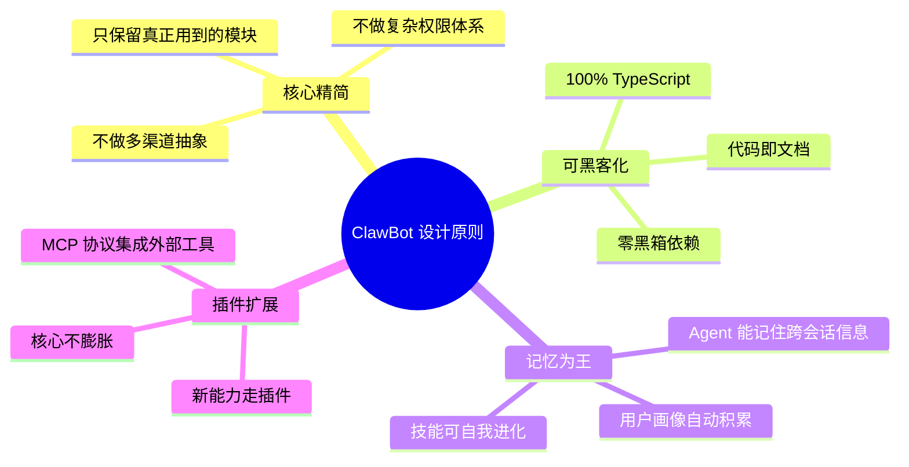

### 与 OpenClaw 的哲学继承

**保留的精髓**：
- ReAct Agent 循环 + 多层容错
- 记忆系统（Agent 主动记忆 + 语义检索）
- Skills 自我迭代（Markdown Prompt 注入）
- 工具体系（定义 + 目录 + 执行）
- 插件 Hook 生命周期

**砍掉的赘肉**：
- 多渠道抽象层（只用飞书）
- WebSocket 实时协议（飞书走 Webhook 回调）
- CLI / Web UI / macOS App / iOS App 客户端
- Node 设备系统（摄像头/屏幕控制）
- 复杂的安全审批体系（个人使用，信任自己的 Agent）
- Canvas / TTS / 图片生成等媒体工具

---

## 2. 整体架构全景

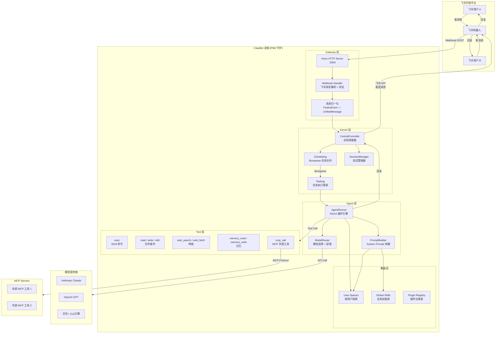

### 架构核心决策

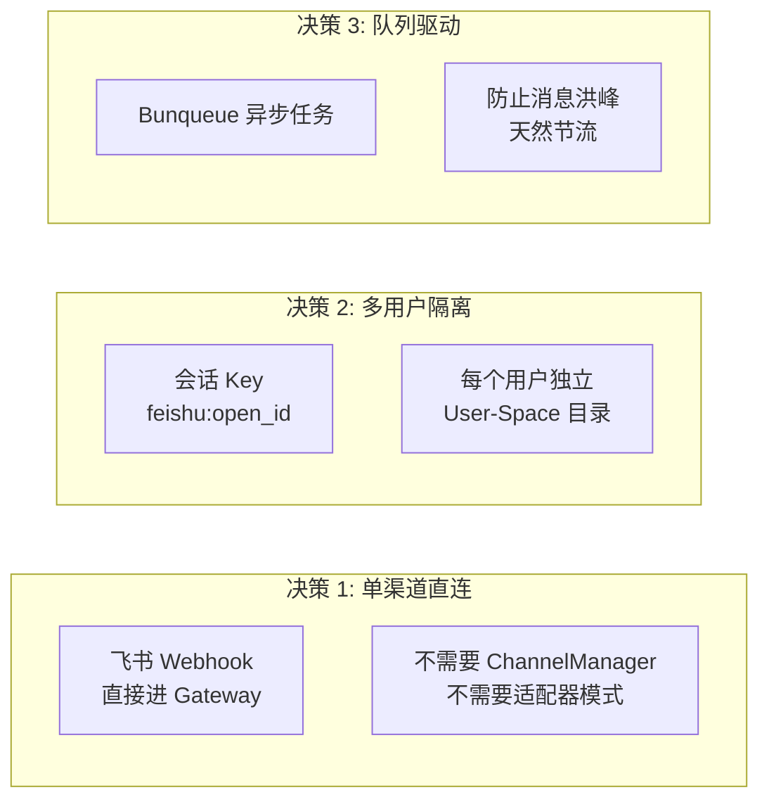

---

## 3. 目录结构

```
clawbot/
├── src/
│   ├── gateway/                    # I/O 层：接收飞书消息
│   │   ├── index.ts                # Hono HTTP 服务入口
│   │   ├── feishu-webhook.ts       # 飞书 Webhook 处理 + 签名验证
│   │   ├── feishu-api.ts           # 飞书 API 封装 (发消息/上传文件等)
│   │   └── normalizer.ts           # 飞书事件 → UnifiedMessage 归一化
│   │
│   ├── kernel/                     # 核心调度层
│   │   ├── central-controller.ts   # 总线调度器
│   │   ├── scheduling.ts           # Bunqueue 队列管理 + 节流策略
│   │   ├── tasking.ts              # 任务执行管家 (组装上下文 → 调 Agent)
│   │   └── session-manager.ts      # 会话管理 (历史加载/持久化/压缩)
│   │
│   ├── agents/                     # Agent 执行引擎
│   │   ├── runner.ts               # ReAct 循环核心
│   │   ├── prompt-builder.ts       # System Prompt 构建器
│   │   ├── model-router.ts         # 模型选择 + 故障转移
│   │   ├── compaction.ts           # 历史消息压缩 (Context Overflow 时触发)
│   │   └── profiles/               # Agent 人格预设 (可选多个 Agent 身份)
│   │       ├── default.ts
│   │       └── coder.ts
│   │
│   ├── tools/                      # 工具体系
│   │   ├── registry.ts             # 工具注册表 + 工具目录
│   │   ├── exec.ts                 # Shell 命令执行
│   │   ├── file-read.ts            # 文件读取
│   │   ├── file-write.ts           # 文件写入
│   │   ├── file-edit.ts            # 文件编辑 (精确替换)
│   │   ├── web-search.ts           # 网络搜索
│   │   ├── web-fetch.ts            # 网页抓取
│   │   ├── memory-read.ts          # 记忆检索
│   │   ├── memory-write.ts         # 记忆写入
│   │   └── mcp-call.ts             # MCP 协议调用外部工具
│   │
│   ├── memory/                     # 记忆系统
│   │   ├── memory-manager.ts       # 记忆管理器 (读写调度)
│   │   ├── embedding.ts            # 向量嵌入 (调用 Embedding API)
│   │   ├── vector-store.ts         # 本地向量存储 (JSON + 余弦相似度)
│   │   └── user-profile.ts         # 用户画像自动提取与更新
│   │
│   ├── skills/                     # 技能系统
│   │   ├── skill-loader.ts         # 技能加载器 (扫描 Markdown → 注入 Prompt)
│   │   └── skill-updater.ts        # 技能自我迭代 (Agent 可修改自己的 Skills)
│   │
│   ├── plugins/                    # 插件系统
│   │   ├── plugin-manager.ts       # 插件生命周期管理
│   │   ├── hook-bus.ts             # Hook 事件总线
│   │   └── builtin/                # 内置插件
│   │       └── cron-plugin.ts      # 定时任务插件
│   │
│   ├── shared/                     # 公共模块
│   │   ├── types.ts                # 全局类型定义
│   │   ├── config.ts               # 配置加载 (env + config.yaml)
│   │   ├── logger.ts               # 日志
│   │   └── utils.ts                # 工具函数
│   │
│   └── index.ts                    # 应用入口 (启动 Gateway + Kernel)
│
├── data/                           # 运行时数据 (git-ignored)
│   ├── users/                      # 按用户隔离的 User-Space
│   │   └── {feishu_open_id}/       # 每个飞书用户一个目录
│   │       ├── SOUL.md             # 该用户的 Agent 人格定义
│   │       ├── USER.md             # 用户画像 (自动积累)
│   │       ├── memory/             # 该用户的记忆库
│   │       │   ├── entries.json    # 记忆条目
│   │       │   └── vectors.json    # 向量索引
│   │       ├── skills/             # 该用户的自定义技能
│   │       ├── sessions/           # 会话历史
│   │       │   └── {session_id}.json
│   │       └── workspace/          # 用户工作空间 (文件操作沙箱)
│   │
│   └── shared/                     # 全局共享数据
│       ├── skills/                 # 全局技能 (所有用户共享)
│       │   ├── coding.md
│       │   ├── web-research.md
│       │   └── writing.md
│       └── plugins/                # 插件目录
│
├── config.yaml                     # 主配置文件
├── package.json
├── tsconfig.json
├── ecosystem.config.js             # PM2 配置
└── README.md
```

---

## 4. 核心模块详细设计

### 4.1 Gateway — I/O 层

Gateway 是系统的入口，职责单一：**接收飞书 Webhook → 归一化 → 交给 Kernel**。

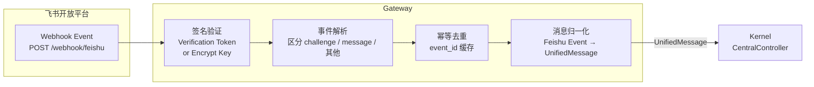

#### Gateway 核心接口

```typescript
// src/gateway/index.ts
import { Hono } from "hono";

const app = new Hono();

// 飞书 Webhook 入口
app.post("/webhook/feishu", async (c) => {
  const body = await c.req.json();

  // 1. URL Verification (首次配置回调时飞书发的验证请求)
  if (body.type === "url_verification") {
    return c.json({ challenge: body.challenge });
  }

  // 2. 签名验证
  if (!verifySignature(c.req, body)) {
    return c.json({ error: "invalid signature" }, 403);
  }

  // 3. 幂等去重 (飞书可能重试推送)
  if (eventCache.has(body.header.event_id)) {
    return c.json({ ok: true });
  }
  eventCache.set(body.header.event_id, Date.now());

  // 4. 归一化 + 派发给 Kernel (异步，不阻塞 Webhook 响应)
  const message = normalizeFeishuEvent(body);
  if (message) {
    centralController.dispatch(message);  // fire-and-forget
  }

  // 5. 立即返回 200，飞书要求 3 秒内响应
  return c.json({ ok: true });
});
```

#### 消息归一化

```typescript
// src/gateway/normalizer.ts
interface UnifiedMessage {
  messageId: string;       // 飞书消息 ID，用于回复
  userId: string;          // 飞书 open_id
  chatId: string;          // 飞书 chat_id (单聊/群聊)
  chatType: "p2p" | "group";
  text: string;            // 纯文本内容
  mentions?: Mention[];    // @提及信息 (群聊中判断是否 @了机器人)
  attachments?: Array<{    // 附件 (图片/文件)
    type: "image" | "file";
    key: string;           // 飞书文件 key
    name?: string;
  }>;
  timestamp: number;
}
```

### 4.2 Kernel — 核心调度

Kernel 是系统的 **大脑和调度中心**，参考 TELEGENT 的设计分为四个子模块。

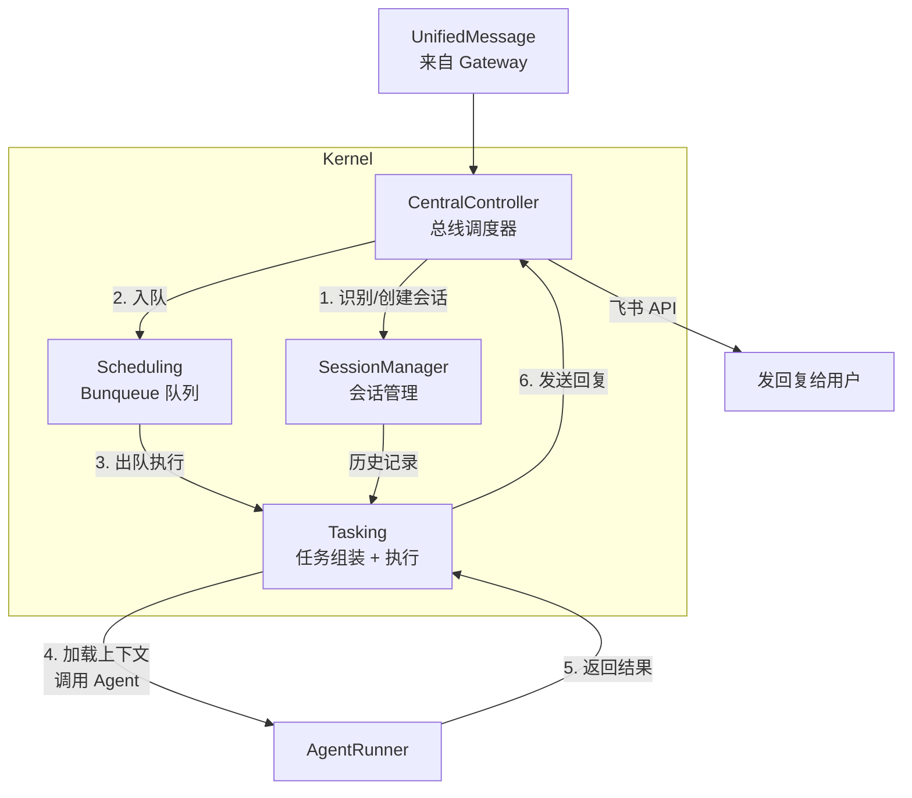

#### 4.2.1 CentralController — 总线调度器

CentralController 是 Kernel 的入口，负责消息分发和结果路由。

```typescript
// src/kernel/central-controller.ts
class CentralController {
  constructor(
    private sessionManager: SessionManager,
    private scheduling: Scheduling,
    private feishuAPI: FeishuAPI,
    private hookBus: HookBus,
  ) {}

  async dispatch(message: UnifiedMessage): Promise<void> {
    // 触发 on-message hook (插件可拦截/修改消息)
    const processed = await this.hookBus.emit("on-message", message);
    if (processed.intercepted) return;

    // 群聊中只响应 @机器人 的消息
    if (message.chatType === "group" && !message.mentions?.some(m => m.isBot)) {
      return;
    }

    // 获取或创建会话
    const session = await this.sessionManager.getOrCreate(message.userId);

    // 入队 (Bunqueue)
    await this.scheduling.enqueue({
      type: "agent-task",
      userId: message.userId,
      message,
      session,
    });
  }

  async sendReply(userId: string, chatId: string, messageId: string, text: string): Promise<void> {
    await this.feishuAPI.replyMessage(messageId, text);
  }
}
```

#### 4.2.2 Scheduling — 任务队列

基于 Bunqueue 实现异步任务调度，天然支持节流和并发控制。

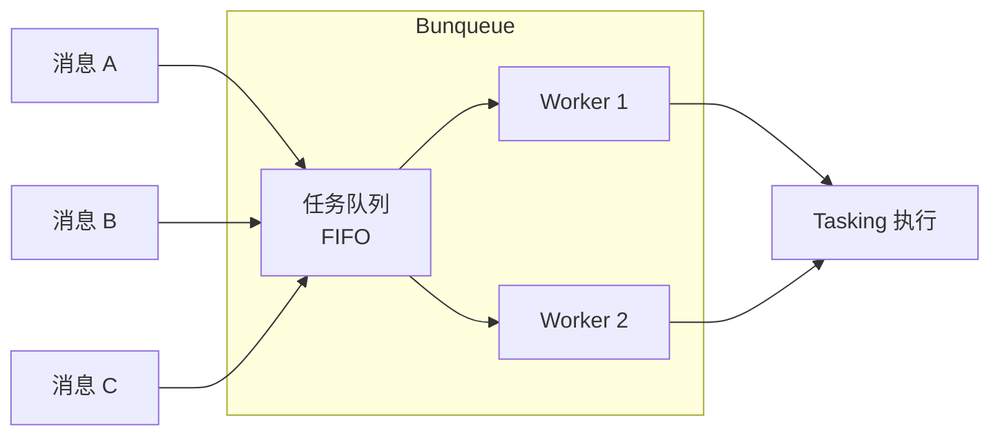

```typescript
// src/kernel/scheduling.ts
import { Queue } from "bunqueue";

class Scheduling {
  private queue: Queue;

  constructor(private tasking: Tasking) {
    this.queue = new Queue({
      concurrency: 2,   // 最多同时处理 2 个任务
      retries: 1,       // 失败重试 1 次
    });

    this.queue.process(async (job) => {
      await this.tasking.execute(job.data);
    });
  }

  async enqueue(task: AgentTask): Promise<void> {
    await this.queue.add(task, {
      priority: task.priority ?? "normal",
      deduplicationKey: task.message.messageId, // 防重
    });
  }
}
```

#### 4.2.3 Tasking — 任务执行管家

Tasking 的职责是 **组装 Agent 所需的全部上下文**，然后调用 AgentRunner。

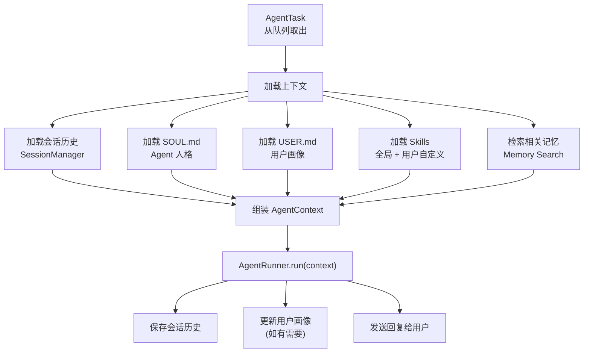

```typescript
// src/kernel/tasking.ts
class Tasking {
  async execute(task: AgentTask): Promise<void> {
    const { userId, message, session } = task;

    // 1. 加载用户态数据
    const soul = await loadUserFile(userId, "SOUL.md");
    const userProfile = await loadUserFile(userId, "USER.md");
    const history = await this.sessionManager.getHistory(userId, session.id);

    // 2. 加载技能
    const globalSkills = await this.skillLoader.loadGlobal();
    const userSkills = await this.skillLoader.loadUser(userId);

    // 3. 检索相关记忆
    const memories = await this.memoryManager.search(userId, message.text);

    // 4. 组装上下文并运行 Agent
    const context: AgentContext = {
      userId, message, history, soul, userProfile,
      skills: [...globalSkills, ...userSkills],
      memories,
      tools: this.toolRegistry.getAvailableTools(),
    };

    const result = await this.agentRunner.run(context);

    // 5. 保存历史 + 发送回复
    await this.sessionManager.appendHistory(userId, session.id, message, result);
    await this.centralController.sendReply(
      userId, message.chatId, message.messageId, result.text
    );

    // 6. 触发 after-agent hook
    await this.hookBus.emit("after-agent", { userId, message, result });
  }
}
```

#### 4.2.4 SessionManager — 会话管理器

```typescript
// src/kernel/session-manager.ts
interface Session {
  id: string;
  userId: string;
  createdAt: number;
  lastActiveAt: number;
}

class SessionManager {
  // 会话超时：超过 30 分钟无活动 → 新会话
  private SESSION_TIMEOUT = 30 * 60 * 1000;

  async getOrCreate(userId: string): Promise<Session> {
    const latest = await this.getLatestSession(userId);

    if (latest && Date.now() - latest.lastActiveAt < this.SESSION_TIMEOUT) {
      latest.lastActiveAt = Date.now();
      await this.save(latest);
      return latest;
    }

    return this.createNew(userId);
  }

  async getHistory(userId: string, sessionId: string): Promise<Message[]> {
    const path = `data/users/${userId}/sessions/${sessionId}.json`;
    return await readJSON(path) ?? [];
  }

  async appendHistory(
    userId: string, sessionId: string,
    userMsg: UnifiedMessage, agentResult: AgentResult
  ): Promise<void> {
    const history = await this.getHistory(userId, sessionId);
    history.push(
      { role: "user", content: userMsg.text, timestamp: userMsg.timestamp },
      { role: "assistant", content: agentResult.text, timestamp: Date.now() },
    );
    await writeJSON(`data/users/${userId}/sessions/${sessionId}.json`, history);
  }
}
```

### 4.3 Agent Runner — ReAct 执行引擎

这是整个系统 **最核心** 的模块 —— Agent 的 ReAct (Reasoning + Acting) 循环。

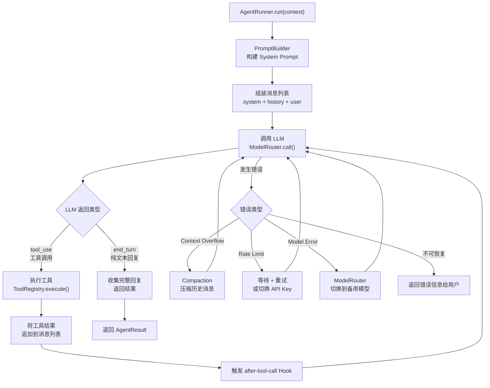

#### ReAct 循环核心实现

```typescript
// src/agents/runner.ts
interface AgentResult {
  text: string;
  toolCalls: ToolCallRecord[];
  tokensUsed: { input: number; output: number };
}

class AgentRunner {
  private MAX_TOOL_ROUNDS = 20;  // 防止无限循环

  async run(context: AgentContext): Promise<AgentResult> {
    // 1. 构建 System Prompt
    const systemPrompt = this.promptBuilder.build(context);

    // 2. 组装初始消息列表
    const messages: LLMMessage[] = [
      { role: "system", content: systemPrompt },
      ...context.history,
      { role: "user", content: this.buildUserContent(context.message) },
    ];

    const toolCallRecords: ToolCallRecord[] = [];
    let totalTokens = { input: 0, output: 0 };

    // 3. ReAct 循环
    for (let round = 0; round < this.MAX_TOOL_ROUNDS; round++) {
      // 触发 before-llm-call Hook
      await this.hookBus.emit("before-llm-call", { messages, round });

      let response: LLMResponse;
      try {
        response = await this.modelRouter.call(messages);
        totalTokens.input += response.usage.input;
        totalTokens.output += response.usage.output;
      } catch (error) {
        response = await this.handleError(error, messages, context);
      }

      // 纯文本回复 → 结束
      if (response.stopReason === "end_turn") {
        return {
          text: response.text,
          toolCalls: toolCallRecords,
          tokensUsed: totalTokens,
        };
      }

      // 工具调用 → 执行工具 → 继续循环
      if (response.stopReason === "tool_use") {
        // 追加 assistant 消息 (包含 tool_use block)
        messages.push({ role: "assistant", content: response.content });

        const toolResults: ToolResultBlock[] = [];
        for (const toolCall of response.toolCalls) {
          const result = await this.toolRegistry.execute(
            toolCall.name, toolCall.input,
            { userId: context.userId, workspaceDir: getUserWorkspace(context.userId) }
          );
          toolCallRecords.push({ ...toolCall, result });
          toolResults.push({
            type: "tool_result",
            tool_use_id: toolCall.id,
            content: truncateResult(result.content, 8000), // 截断过长结果
          });

          // 触发 after-tool-call Hook
          await this.hookBus.emit("after-tool-call", { toolCall, result });
        }

        // 追加 user 消息 (包含 tool_result blocks)
        messages.push({ role: "user", content: toolResults });
      }
    }

    return {
      text: "[ClawBot] 工具调用次数超过限制，已停止执行。",
      toolCalls: toolCallRecords,
      tokensUsed: totalTokens,
    };
  }

  private async handleError(
    error: unknown, messages: LLMMessage[], context: AgentContext
  ): Promise<LLMResponse> {
    if (isContextOverflowError(error)) {
      // 压缩历史消息后重试
      const compacted = await this.compaction.compact(messages);
      messages.length = 0;
      messages.push(...compacted);
      return this.modelRouter.call(messages);
    }

    if (isRateLimitError(error)) {
      // 切换 API Key 或等待后重试
      await this.modelRouter.markCurrentKeyFailed();
      return this.modelRouter.call(messages);
    }

    if (isModelUnavailableError(error)) {
      // 切换到备用模型
      this.modelRouter.failover();
      return this.modelRouter.call(messages);
    }

    throw error; // 不可恢复的错误
  }
}
```

#### System Prompt 构建

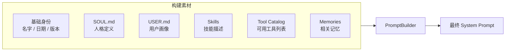

```typescript
// src/agents/prompt-builder.ts
class PromptBuilder {
  build(context: AgentContext): string {
    const sections: string[] = [];

    // 基础身份
    sections.push(`# 身份
你是 ClawBot，一个强大的个人 AI 助理。
当前时间：${new Date().toISOString()}
`);

    // SOUL.md — Agent 人格
    if (context.soul) {
      sections.push(`# 人格设定\n${context.soul}`);
    }

    // USER.md — 用户画像
    if (context.userProfile) {
      sections.push(`# 关于当前用户\n${context.userProfile}`);
    }

    // Skills — 技能描述
    if (context.skills.length > 0) {
      sections.push("# 技能");
      for (const skill of context.skills) {
        sections.push(`## ${skill.name}\n${skill.content}`);
      }
    }

    // Memories — 相关记忆
    if (context.memories.length > 0) {
      sections.push("# 相关记忆（来自过往对话）");
      for (const mem of context.memories) {
        sections.push(`- [${mem.createdAt}] ${mem.content}`);
      }
    }

    // Tool Catalog — 可用工具说明
    sections.push(`# 可用工具
你有以下工具可以使用。当你需要执行操作时，请调用对应工具。
只在确实需要时使用工具，简单问答直接回复即可。
`);

    return sections.join("\n\n---\n\n");
  }
}
```

### 4.4 Tool System — 工具体系

借鉴 OpenClaw 的三层设计：**工具定义** → **工具注册表** → **工具执行**。

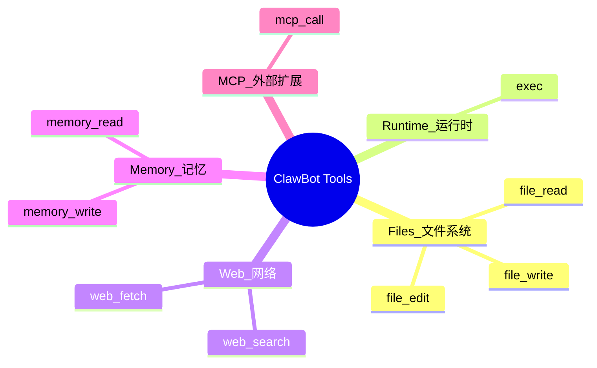

#### 工具接口定义

```typescript
// src/tools/registry.ts
interface ToolDefinition {
  name: string;
  description: string;
  parameters: Record<string, unknown>; // JSON Schema
  execute(params: unknown, context: ToolContext): Promise<ToolResult>;
}

interface ToolContext {
  userId: string;
  workspaceDir: string; // 用户独立的工作空间路径
}

interface ToolResult {
  content: string;
  isError?: boolean;
}

class ToolRegistry {
  private tools = new Map<string, ToolDefinition>();

  register(tool: ToolDefinition): void {
    this.tools.set(tool.name, tool);
  }

  // 插件也可以通过这个方法注册工具
  registerFromPlugin(pluginName: string, tools: ToolDefinition[]): void {
    for (const tool of tools) {
      this.tools.set(`${pluginName}.${tool.name}`, tool);
    }
  }

  getAvailableTools(): ToolDefinition[] {
    return Array.from(this.tools.values());
  }

  // 转换为 LLM API 要求的 tool schema 格式
  toLLMTools(): LLMToolSchema[] {
    return this.getAvailableTools().map(t => ({
      name: t.name,
      description: t.description,
      input_schema: t.parameters,
    }));
  }

  async execute(name: string, params: unknown, context: ToolContext): Promise<ToolResult> {
    const tool = this.tools.get(name);
    if (!tool) return { content: `Unknown tool: ${name}`, isError: true };

    try {
      return await tool.execute(params, context);
    } catch (error) {
      return { content: `Tool error: ${error.message}`, isError: true };
    }
  }
}
```

#### exec 工具 — Shell 命令执行

```typescript
// src/tools/exec.ts
const execTool: ToolDefinition = {
  name: "exec",
  description: "在服务器上执行 Shell 命令。可以用来运行脚本、安装软件、查看系统状态等。",
  parameters: {
    type: "object",
    properties: {
      command: { type: "string", description: "要执行的 Shell 命令" },
      timeout: { type: "number", description: "超时时间(秒)，默认 30", default: 30 },
      cwd: { type: "string", description: "工作目录，默认为用户 workspace" },
    },
    required: ["command"],
  },
  async execute(params, context) {
    const { command, timeout = 30, cwd } = params as ExecParams;
    const workDir = cwd ?? context.workspaceDir;

    const proc = Bun.spawn(["sh", "-c", command], {
      cwd: workDir,
      timeout: timeout * 1000,
      stdout: "pipe",
      stderr: "pipe",
    });

    const stdout = await new Response(proc.stdout).text();
    const stderr = await new Response(proc.stderr).text();
    const exitCode = await proc.exited;

    let output = "";
    if (stdout) output += stdout;
    if (stderr) output += `\n[stderr]\n${stderr}`;
    if (exitCode !== 0) output += `\n[exit code: ${exitCode}]`;

    return { content: output || "(no output)", isError: exitCode !== 0 };
  },
};
```

#### MCP 工具 — 外部工具扩展

通过 MCP (Model Context Protocol) 客户端接入外部工具，这是替代复杂插件系统的关键设计。

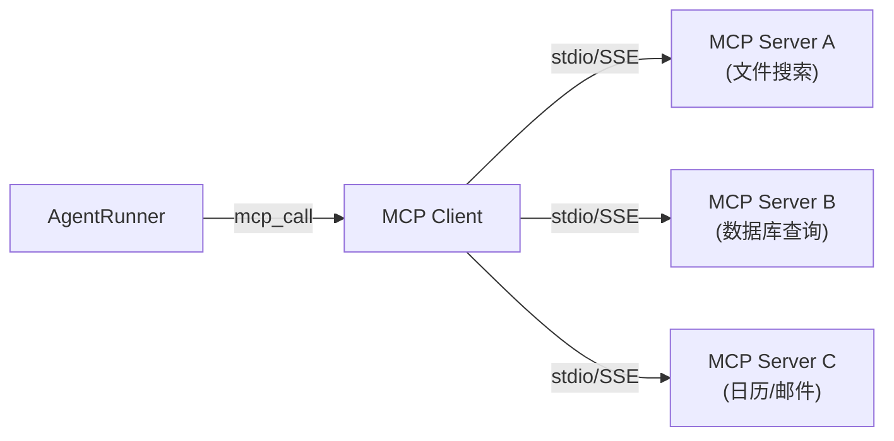

```typescript
// src/tools/mcp-call.ts
// Agent 调用时：mcp_call({ server: "xxx", tool: "yyy", args: {...} })
// 底层通过 MCP Client SDK 转发请求
```

### 4.5 Memory System — 记忆系统

记忆系统是 ClawBot 区别于普通聊天 bot 的核心能力。借鉴 OpenClaw 的思路，Agent **主动决定** 什么值得记住。

```mermaid
graph TB
    subgraph WriteFlow["记忆写入流程"]
        Conv["对话进行中"] --> AgentJudge{"Agent 判断\n这条信息值得记住吗?"}
        AgentJudge -->|"是"| CallWrite["调用 memory_write 工具"]
        CallWrite --> Extract["提取关键信息\n+ 生成摘要"]
        Extract --> Embed["Embedding API\n生成向量"]
        Embed --> Store["存储到 User-Space\nmemory/entries.json\nmemory/vectors.json"]
    end

    subgraph ReadFlow["记忆检索流程"]
        NewMsg["新消息到达"] --> TaskingSearch["Tasking 阶段\n自动检索相关记忆"]
        TaskingSearch --> QueryEmbed["对消息文本\n生成 Embedding"]
        QueryEmbed --> VectorSearch["向量余弦相似度\nTop-K 检索"]
        VectorSearch --> InjectPrompt["注入 System Prompt\n作为上下文"]
    end

    subgraph ProfileFlow["用户画像更新"]
        Conv2["对话结束后"] --> ProfileHook["after-agent Hook"]
        ProfileHook --> ProfileAgent["用轻量模型分析\n对话中的用户特征"]
        ProfileAgent --> UpdateUSER["追加到 USER.md"]
    end
```

#### 记忆数据结构

```typescript
// src/memory/memory-manager.ts
interface MemoryEntry {
  id: string;
  userId: string;
  content: string;          // 记忆内容 (自然语言)
  category: string;         // 分类: preference / fact / event / skill
  importance: number;       // 重要性 1-10
  createdAt: string;        // ISO timestamp
  source: {
    sessionId: string;
    messageId: string;
  };
}

interface VectorEntry {
  id: string;               // 对应 MemoryEntry.id
  vector: number[];         // embedding 向量
}

class MemoryManager {
  async write(userId: string, entry: Omit<MemoryEntry, "id">): Promise<void> {
    const id = generateId();
    const fullEntry: MemoryEntry = { id, ...entry };

    // 存储记忆条目
    const entries = await this.loadEntries(userId);
    entries.push(fullEntry);
    await this.saveEntries(userId, entries);

    // 生成并存储向量
    const vector = await this.embedding.embed(entry.content);
    const vectors = await this.loadVectors(userId);
    vectors.push({ id, vector });
    await this.saveVectors(userId, vectors);
  }

  async search(userId: string, query: string, topK = 5): Promise<MemoryEntry[]> {
    const queryVector = await this.embedding.embed(query);
    const vectors = await this.loadVectors(userId);
    const entries = await this.loadEntries(userId);

    // 余弦相似度排序
    const scored = vectors.map(v => ({
      id: v.id,
      score: cosineSimilarity(queryVector, v.vector),
    }));
    scored.sort((a, b) => b.score - a.score);

    // 返回 Top-K
    const topIds = new Set(scored.slice(0, topK).map(s => s.id));
    return entries.filter(e => topIds.has(e.id));
  }
}
```

#### 用户画像 (USER.md) 自动维护

USER.md 是一个 Markdown 文件，记录用户的偏好、习惯、背景等信息。它不是由记忆工具直接写入，而是由 **after-agent Hook** 自动分析每次对话后更新。

```markdown
<!-- data/users/{userId}/USER.md 示例 -->
# 用户画像

## 基本信息
- 职业：Agent 开发工程师
- 技术栈：TypeScript, Python, Bun

## 偏好
- 喜欢简洁直接的回答
- 代码风格偏好函数式
- 常用编辑器：Cursor

## 最近关注
- 正在研究 OpenClaw 架构
- 对 MCP 协议很感兴趣

## 沟通风格
- 用中文交流
- 不需要过度解释基础概念
```

### 4.6 Skills System — 技能系统

Skills 是 **可动态加载的 Prompt 增强机制**，本质是 Markdown 文件。它的核心创新点在于 **Agent 可以自我迭代技能**。

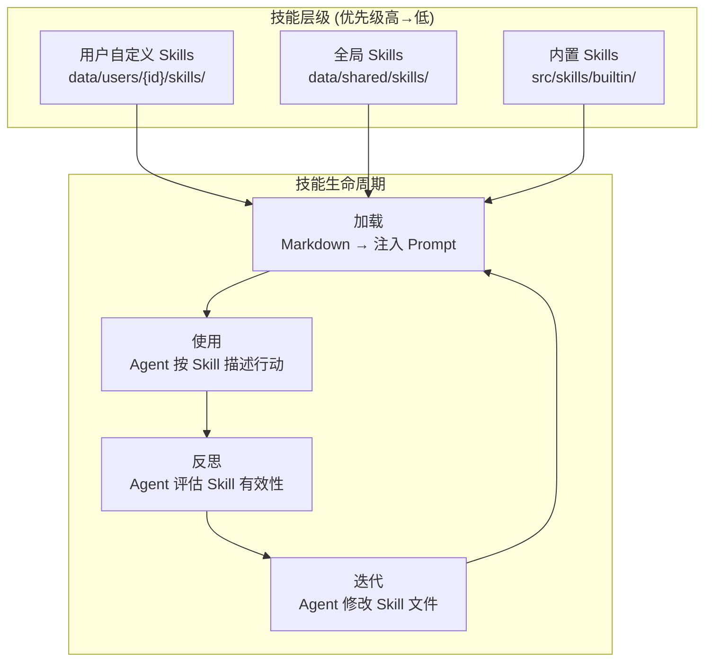

#### 技能文件格式

```markdown
<!-- data/shared/skills/coding.md -->
# coding

当用户请求编写或修改代码时，遵循以下原则：

## 代码风格
- 优先使用函数式风格
- 变量命名使用 camelCase
- 每个函数不超过 30 行

## 工作流程
1. 先理解需求，必要时提问
2. 先设计接口，再实现细节
3. 编写代码后用 exec 工具运行测试

## 禁止事项
- 不要生成超过 200 行的单文件
- 不要使用 any 类型
```

#### 技能自我迭代机制

Agent 可以通过 `file_write` 工具直接修改 Skills 文件，实现自我进化。

```typescript
// src/skills/skill-updater.ts
// Agent 触发场景：
// "我发现你上次写的代码没有加错误处理，以后记得加上"
// → Agent 调用 file_write 修改 coding.md，加入错误处理的规则
// → 下次构建 Prompt 时，新规则自动生效

class SkillUpdater {
  // 在 after-agent Hook 中，周期性地让 Agent 反思技能有效性
  async reflectAndUpdate(userId: string, context: ReflectionContext): Promise<void> {
    // 每 N 次对话触发一次反思
    if (context.conversationCount % 10 !== 0) return;

    const currentSkills = await this.skillLoader.loadAll(userId);
    const recentHistory = await this.getRecentHistory(userId, 10);

    // 用轻量模型分析：最近对话中，哪些 Skill 需要调整
    const reflection = await this.modelRouter.call([
      { role: "system", content: REFLECTION_PROMPT },
      { role: "user", content: JSON.stringify({ currentSkills, recentHistory }) },
    ], { model: "fast" }); // 用便宜的模型做反思

    if (reflection.suggestions?.length > 0) {
      // Agent 自行决定是否应用修改
      for (const suggestion of reflection.suggestions) {
        await this.applySkillUpdate(userId, suggestion);
      }
    }
  }
}
```

### 4.7 Plugin System — 插件系统

轻量化的 Hook 机制，保持核心精简，新能力通过插件扩展。

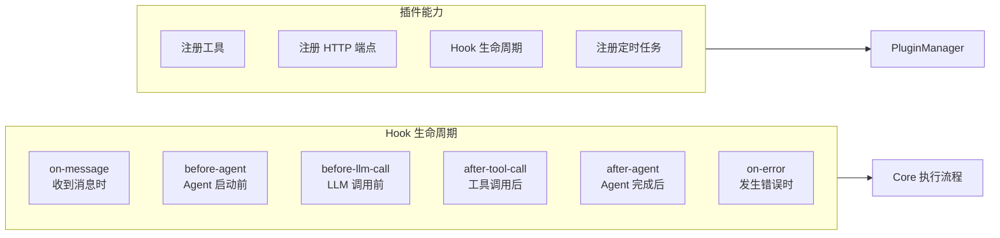

#### 插件接口

```typescript
// src/plugins/plugin-manager.ts
interface ClawBotPlugin {
  name: string;
  version: string;

  // 注册工具
  tools?: ToolDefinition[];

  // Hook 生命周期
  hooks?: Partial<{
    "on-message": (ctx: MessageHookContext) => Promise<HookResult>;
    "before-agent": (ctx: AgentHookContext) => Promise<void>;
    "before-llm-call": (ctx: LLMCallHookContext) => Promise<void>;
    "after-tool-call": (ctx: ToolCallHookContext) => Promise<void>;
    "after-agent": (ctx: AgentResultHookContext) => Promise<void>;
    "on-error": (ctx: ErrorHookContext) => Promise<void>;
  }>;

  // 注册 HTTP 端点 (挂到 Hono 上)
  routes?: Array<{
    method: "GET" | "POST";
    path: string;
    handler: (c: Context) => Promise<Response>;
  }>;

  // 定时任务
  cron?: Array<{
    schedule: string;  // cron 表达式
    handler: () => Promise<void>;
  }>;
}
```

#### 内置插件示例：定时任务

```typescript
// src/plugins/builtin/cron-plugin.ts
const cronPlugin: ClawBotPlugin = {
  name: "cron",
  version: "1.0.0",

  cron: [
    {
      schedule: "0 9 * * *", // 每天早上 9 点
      async handler() {
        // 给 owner 发一条每日总结
      },
    },
  ],

  hooks: {
    "after-agent": async (ctx) => {
      // 可以在每次对话后做一些统计
    },
  },
};
```

### 4.8 User-Space — 用户态数据

每个飞书用户拥有完全隔离的 User-Space。

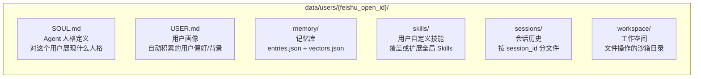

#### SOUL.md — Agent 人格定义

SOUL.md 定义了 Agent 面对这个特定用户时的人格。不同用户可以拥有不同的 SOUL.md，让同一个 ClawBot 对不同人展现不同风格。

```markdown
<!-- data/users/{id}/SOUL.md 示例 -->
# ClawBot 人格设定

你是一个高效、直接、有幽默感的 AI 助理。

## 核心原则
- 回答简洁，不废话
- 遇到模糊需求时主动追问
- 执行任务前先确认关键参数
- 对代码相关问题，优先给出可运行的示例

## 语言
- 默认使用中文交流
- 代码注释用英文

## 边界
- 不要自作主张删除重要文件
- 涉及金钱/发布操作时必须确认
```

#### 首次用户初始化

```typescript
// 当新用户首次发消息时，自动创建 User-Space
async function initUserSpace(userId: string): Promise<void> {
  const baseDir = `data/users/${userId}`;

  await mkdir(`${baseDir}/memory`, { recursive: true });
  await mkdir(`${baseDir}/skills`, { recursive: true });
  await mkdir(`${baseDir}/sessions`, { recursive: true });
  await mkdir(`${baseDir}/workspace`, { recursive: true });

  // 复制默认 SOUL.md
  await copyFile("data/shared/defaults/SOUL.md", `${baseDir}/SOUL.md`);

  // 创建空 USER.md
  await writeFile(`${baseDir}/USER.md`, "# 用户画像\n\n（尚未建立，将在对话中自动积累）\n");
}
```

### 4.9 Multi-Model — 多模型管理

借鉴 OpenClaw 的 Auth Profile 轮转 + 故障转移设计。

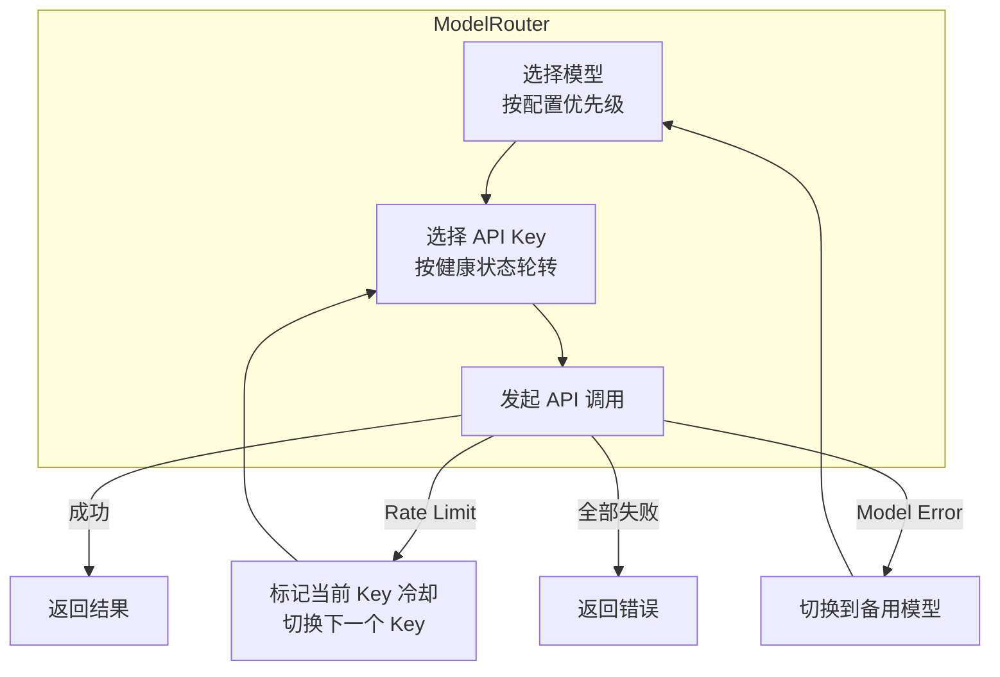

#### 配置示例

```yaml
# config.yaml
models:
  primary: claude-sonnet-4
  fallbacks:
    - claude-haiku-3-5
    - gpt-4o-mini
    - doubao-pro

  profiles:
    - name: anthropic-key-1
      provider: anthropic
      apiKey: ${ANTHROPIC_API_KEY_1}
    - name: anthropic-key-2
      provider: anthropic
      apiKey: ${ANTHROPIC_API_KEY_2}
    - name: openai-key-1
      provider: openai
      apiKey: ${OPENAI_API_KEY}
    - name: doubao-key-1
      provider: volcengine
      apiKey: ${DOUBAO_API_KEY}
      endpoint: https://ark.cn-beijing.volces.com/api/v3

  # Compaction 用的轻量模型 (便宜、快)
  compaction_model: claude-haiku-3-5
  # 反思/用户画像用的轻量模型
  reflection_model: claude-haiku-3-5
```

```typescript
// src/agents/model-router.ts
class ModelRouter {
  private profiles: AuthProfile[];
  private currentProfileIndex = 0;
  private failedProfiles = new Map<string, { until: number }>();

  async call(messages: LLMMessage[], options?: { model?: string }): Promise<LLMResponse> {
    const model = options?.model ?? this.config.primary;
    const profile = this.selectHealthyProfile(model);

    try {
      return await this.callProvider(profile, model, messages);
    } catch (error) {
      if (isRateLimitError(error)) {
        this.cooldown(profile, 60_000); // 冷却 60 秒
        return this.call(messages, options);  // 重试 (会选下一个 profile)
      }
      throw error;
    }
  }

  failover(): void {
    const fallbacks = this.config.fallbacks;
    // 从 fallback 链中选下一个可用的
    for (const model of fallbacks) {
      const profile = this.selectHealthyProfile(model);
      if (profile) {
        this.config.primary = model;
        return;
      }
    }
    throw new Error("All models unavailable");
  }
}
```

---

## 5. 飞书接入详细设计

### 飞书机器人配置要求

在飞书开放平台创建企业自建应用，开启机器人能力：

- 事件订阅 URL：`https://{your-domain}/webhook/feishu`
- 订阅事件：`im.message.receive_v1`（接收消息）
- 权限：`im:message`（读取消息）、`im:message:send_as_bot`（发送消息）

### Webhook 事件处理流程

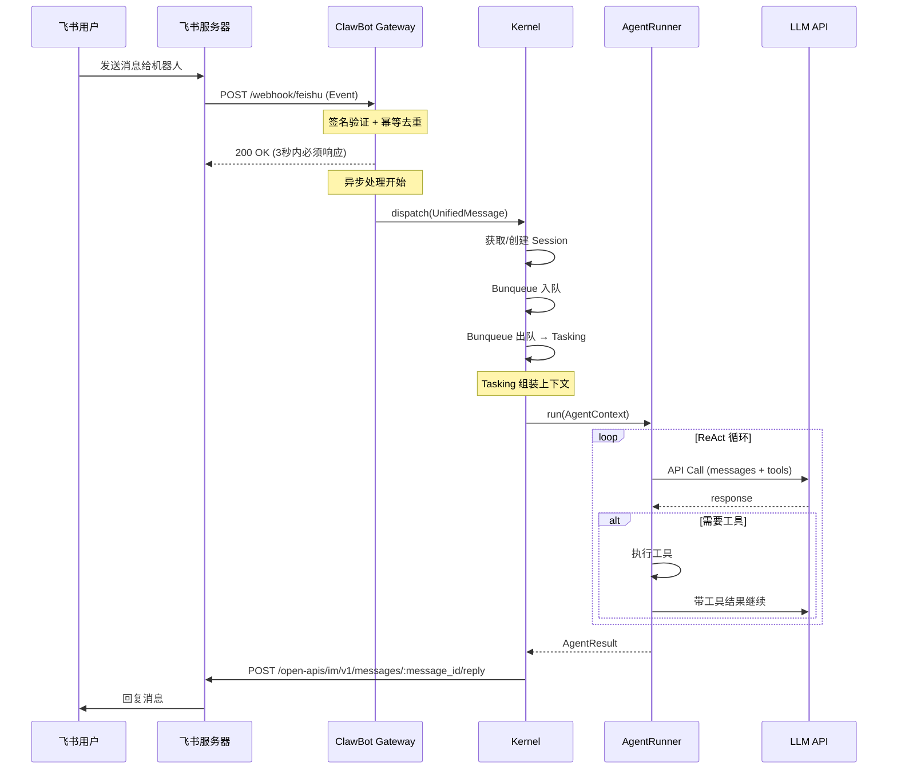

### 飞书消息类型处理

```typescript
// src/gateway/feishu-webhook.ts

function normalizeFeishuEvent(body: FeishuEventBody): UnifiedMessage | null {
  const event = body.event;
  const msg = event.message;

  // 只处理文本和富文本消息
  const content = JSON.parse(msg.content);

  let text = "";
  let attachments: Attachment[] = [];

  switch (msg.message_type) {
    case "text":
      text = content.text;
      break;
    case "post":  // 富文本
      text = extractTextFromPost(content);
      attachments = extractImagesFromPost(content);
      break;
    case "image":
      attachments = [{ type: "image", key: content.image_key }];
      text = "[用户发送了一张图片]";
      break;
    case "file":
      attachments = [{ type: "file", key: content.file_key, name: content.file_name }];
      text = `[用户发送了文件: ${content.file_name}]`;
      break;
    default:
      return null; // 不支持的消息类型，忽略
  }

  return {
    messageId: msg.message_id,
    userId: event.sender.sender_id.open_id,
    chatId: msg.chat_id,
    chatType: msg.chat_type === "p2p" ? "p2p" : "group",
    text,
    mentions: msg.mentions?.map(m => ({
      userId: m.id.open_id,
      name: m.name,
      isBot: m.id.open_id === BOT_OPEN_ID,
    })),
    attachments,
    timestamp: parseInt(msg.create_time),
  };
}
```

### 飞书 API 封装

```typescript
// src/gateway/feishu-api.ts
class FeishuAPI {
  private tenantAccessToken: string = "";
  private tokenExpiresAt: number = 0;

  // 确保 token 有效
  private async ensureToken(): Promise<void> {
    if (Date.now() < this.tokenExpiresAt - 60_000) return;

    const res = await fetch(
      "https://open.feishu.cn/open-apis/auth/v3/tenant_access_token/internal",
      {
        method: "POST",
        headers: { "Content-Type": "application/json" },
        body: JSON.stringify({
          app_id: config.feishu.appId,
          app_secret: config.feishu.appSecret,
        }),
      }
    );
    const data = await res.json();
    this.tenantAccessToken = data.tenant_access_token;
    this.tokenExpiresAt = Date.now() + data.expire * 1000;
  }

  // 回复消息
  async replyMessage(messageId: string, text: string): Promise<void> {
    await this.ensureToken();

    // 飞书单条消息长度限制，超长需要分段
    const chunks = splitMessageIfNeeded(text, 4000);

    for (let i = 0; i < chunks.length; i++) {
      const endpoint = i === 0
        ? `https://open.feishu.cn/open-apis/im/v1/messages/${messageId}/reply`
        : `https://open.feishu.cn/open-apis/im/v1/messages`;

      await fetch(endpoint, {
        method: "POST",
        headers: {
          "Authorization": `Bearer ${this.tenantAccessToken}`,
          "Content-Type": "application/json",
        },
        body: JSON.stringify({
          msg_type: "text",
          content: JSON.stringify({ text: chunks[i] }),
          ...(i > 0 ? { receive_id: messageId } : {}),
        }),
      });
    }
  }
}
```

---

## 6. 关键数据流

### 6.1 完整消息处理链路

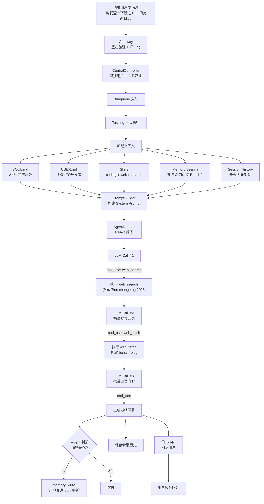

### 6.2 记忆系统数据流

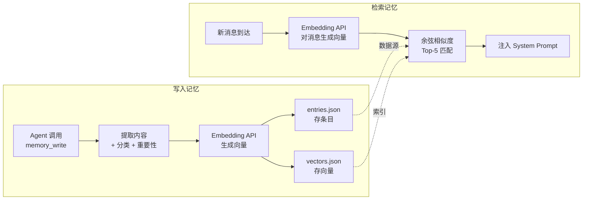

### 6.3 Skills 加载与迭代流程

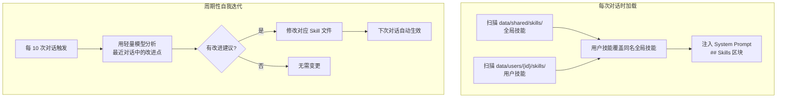

---

## 7. 技术选型

| 模块 | 选型 | 选择理由 |
|------|------|----------|
| 运行时 | **Bun** | 比 Node.js 快，原生支持 TS，内置测试框架 |
| 语言 | **TypeScript** | 类型安全，Agent 编排系统首选 |
| HTTP 框架 | **Hono** | 轻量极速，边缘就绪，API 优雅 |
| 任务队列 | **Bunqueue** | 基于 Bun 原生，轻量异步任务管理 |
| 进程守护 | **PM2** | 成熟稳定，自动重启 + 日志管理 |
| 数据验证 | **Zod** | TypeScript-first，运行时类型校验 |
| 向量嵌入 | **OpenAI Embedding API** | 或本地替代方案如 ONNX |
| 配置管理 | **yaml + dotenv** | 分离敏感信息与普通配置 |
| 日志 | **pino** | 高性能 JSON Logger |
| MCP 客户端 | **@modelcontextprotocol/sdk** | 官方 SDK，接入外部工具 |

### PM2 配置

```javascript
// ecosystem.config.js
module.exports = {
  apps: [
    {
      name: "clawbot",
      script: "src/index.ts",
      interpreter: "bun",
      watch: false,
      max_memory_restart: "512M",
      env: {
        NODE_ENV: "production",
        PORT: 3000,
      },
      error_file: "logs/error.log",
      out_file: "logs/output.log",
    },
  ],
};
```

---

## 8. 与 OpenClaw 的差异对比

| 维度 | OpenClaw | ClawBot |
|------|----------|---------|
| 目标用户 | 所有人 | 自己 + 身边的人 |
| 渠道 | WhatsApp/Telegram/Slack/Discord/iMessage/WebChat | 飞书 only |
| 客户端 | CLI + Web UI + macOS App + iOS App | 无 (飞书即客户端) |
| 通信协议 | WebSocket (自定义 Wire Protocol) | HTTP Webhook (飞书原生) |
| 运行时 | Node.js ≥22 | Bun |
| HTTP 框架 | Express 5 | Hono |
| 任务队列 | 无 (同步处理) | Bunqueue |
| 进程管理 | 无 (手动启动) | PM2 |
| 用户模型 | Owner + 外部用户 + 信任分级 | 多飞书用户, 平等信任 |
| 安全审批 | 高危命令需用户确认 | 不做 (信任 Agent) |
| 渠道抽象 | ChannelPlugin 接口 + 多适配器 | 直连飞书 API (无抽象层) |
| Node 设备 | macOS/iOS 原生能力节点 | 不做 |
| 子 Agent | sessions_spawn 动态子 Agent | 暂不做 (后续可加) |
| Skills | 三级优先级 (workspace/managed/bundled) | 二级 (用户/全局) + 自我迭代 |
| 记忆 | 插件式后端 (可切换) | 内置本地向量搜索 |
| 插件系统 | 完整 (工具/CLI/HTTP/Hook/Gateway方法) | 轻量 (工具/Hook/HTTP/Cron) |
| 工具数量 | 11 类 20+ 工具 | 6 类核心工具 + MCP 扩展 |
| 代码规模 | ~2万行 | 目标 ~3000 行 |

---

*文档版本：v0.1*
*设计时间：2026-02-26*
*作者：Agent 开发工程师*
