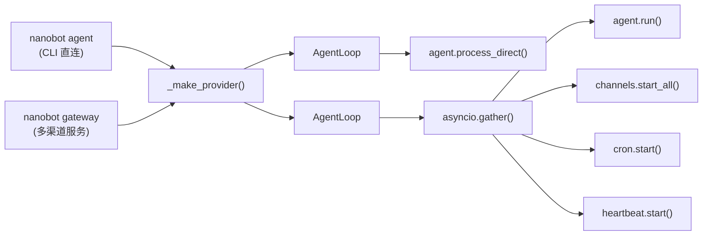
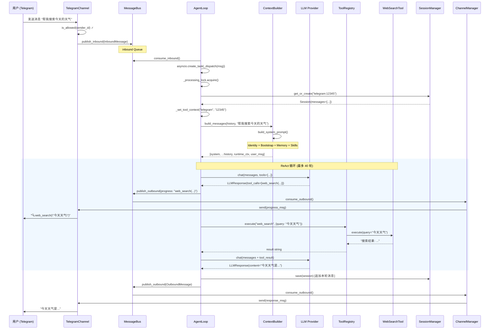
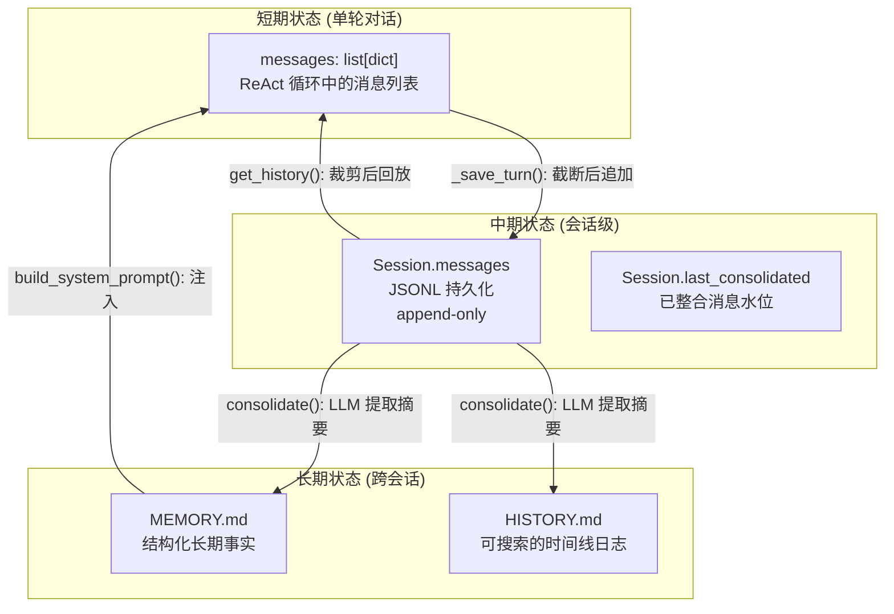
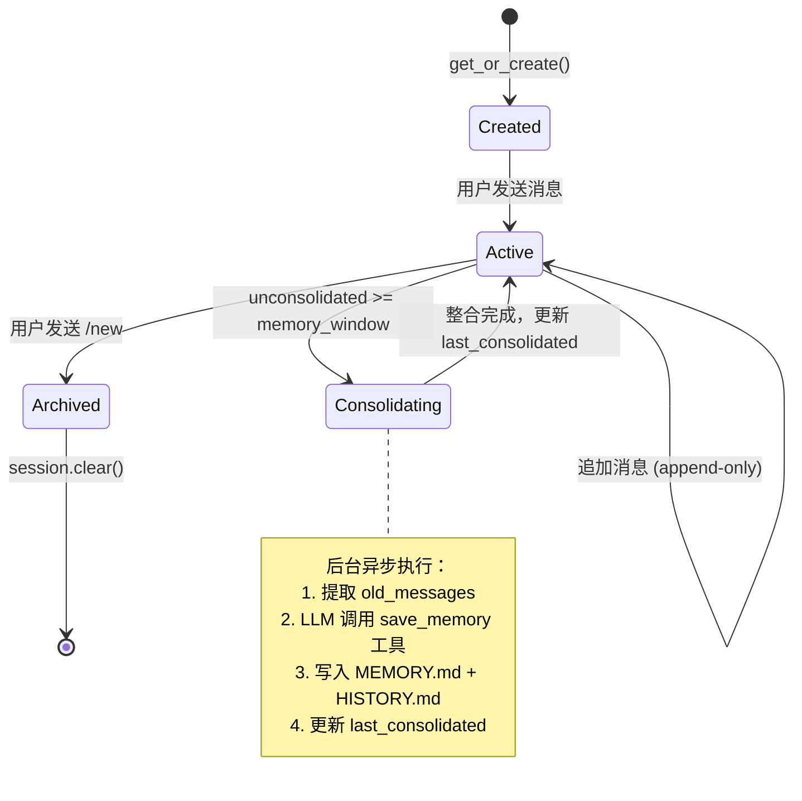
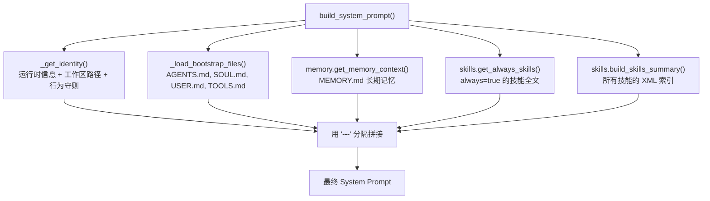
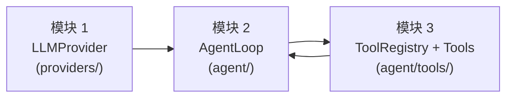
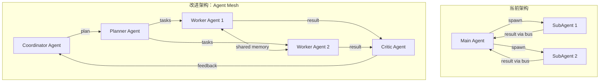
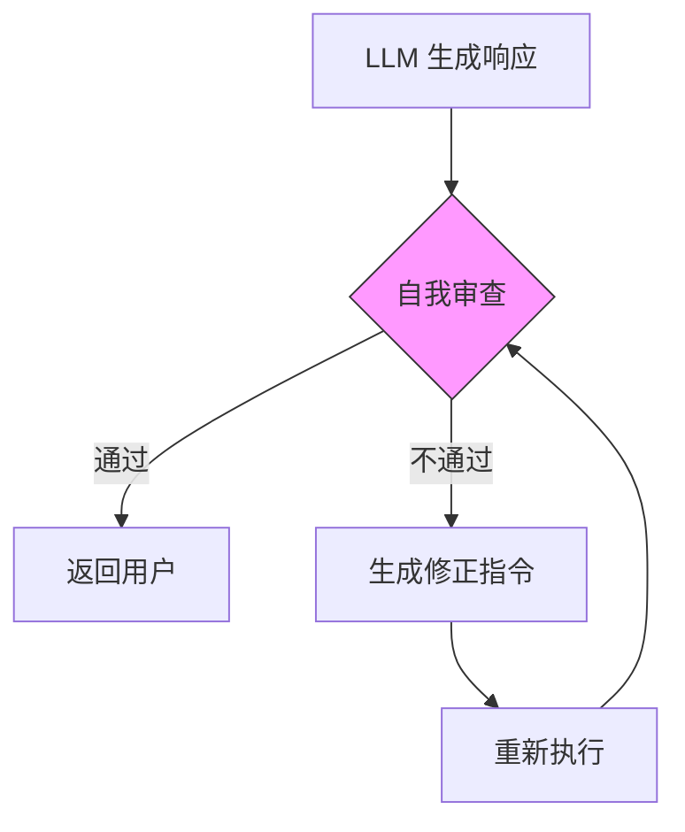

# NanoBot 架构深度分析与复刻指南

> 基于 [HKUDS/nanobot](https://github.com/HKUDS/nanobot) v0.1.4.post2 源码分析
> 核心代码约 **3,966 行**（不含渠道适配层和测试）

---

## 目录

- [第一阶段：宏观架构与技术栈扫描](#第一阶段宏观架构与技术栈扫描)
  - [1.1 项目目录结构](#11-项目目录结构)
  - [1.2 入口点分析](#12-入口点分析)
  - [1.3 "Bot" 的定义：ReAct 循环](#13-bot-的定义react-循环)
  - [1.4 技术栈评价](#14-技术栈评价)
- [第二阶段：核心链路深度拆解](#第二阶段核心链路深度拆解)
  - [2.1 完整请求链路追踪](#21-完整请求链路追踪)
  - [2.2 状态管理：Context 与 Memory 生命周期](#22-状态管理context-与-memory-生命周期)
  - [2.3 Prompt 策略与 Tool Calling 实现](#23-prompt-策略与-tool-calling-实现)
- [第三阶段：工程复刻指南](#第三阶段工程复刻指南)
  - [3.1 最小化依赖清单](#31-最小化依赖清单)
  - [3.2 MVP 开发建议：三个核心模块](#32-mvp-开发建议三个核心模块)
  - [3.3 坑点预警](#33-坑点预警)
- [第四阶段：改进与实验建议](#第四阶段改进与实验建议)

---

## 第一阶段：宏观架构与技术栈扫描

### 1.1 项目目录结构

```
nanobot/                         # 核心 Python 包
├── __init__.py                  # 版本信息
├── __main__.py                  # python -m nanobot 入口
│
├── cli/                         # 🖥️ CLI 层（Typer）
│   └── commands.py              # 1124 行 | 所有命令定义 + gateway 初始化
│
├── agent/                       # 🧠 核心 Agent 逻辑
│   ├── loop.py                  # 501 行  | Agent 主循环（核心引擎）
│   ├── context.py               # 161 行  | Prompt 构建器
│   ├── memory.py                # 150 行  | 双层记忆系统
│   ├── skills.py                # 228 行  | 技能加载器
│   ├── subagent.py              # 256 行  | 子 Agent 管理
│   └── tools/                   # 内置工具集
│       ├── base.py              # 102 行  | Tool 抽象基类
│       ├── registry.py          #  66 行  | 工具注册表
│       ├── shell.py             # 158 行  | Shell 命令执行
│       ├── filesystem.py        # 244 行  | 文件读写编辑
│       ├── web.py               # 172 行  | Web 搜索 + 抓取
│       ├── message.py           # 108 行  | 消息发送
│       ├── spawn.py             #  63 行  | 子 Agent 创建
│       ├── mcp.py               #  99 行  | MCP 协议桥接
│       └── cron.py              # 147 行  | 定时任务
│
├── bus/                         # 🚌 消息总线
│   ├── events.py                #  38 行  | InboundMessage / OutboundMessage
│   └── queue.py                 #  44 行  | asyncio.Queue 双队列
│
├── channels/                    # 📱 渠道适配层
│   ├── base.py                  # 131 行  | BaseChannel 抽象基类
│   ├── manager.py               # 233 行  | 渠道管理器 + 出站分发
│   ├── telegram.py              # 459 行  | Telegram Bot
│   ├── discord.py               # 301 行  | Discord Gateway
│   ├── slack.py                 # 281 行  | Slack Socket Mode
│   ├── feishu.py                # 759 行  | 飞书 WebSocket
│   ├── mochat.py                # 895 行  | Mochat Socket.IO
│   ├── whatsapp.py              # 148 行  | WhatsApp Bridge
│   ├── dingtalk.py              # 247 行  | 钉钉 Stream
│   ├── email.py                 # 408 行  | IMAP/SMTP
│   └── qq.py                    # 132 行  | QQ botpy
│
├── providers/                   # 🤖 LLM 提供商抽象
│   ├── base.py                  # 110 行  | LLMProvider ABC
│   ├── registry.py              # 462 行  | ProviderSpec 注册表
│   ├── litellm_provider.py      # 273 行  | LiteLLM 统一调用
│   ├── custom_provider.py       #  52 行  | 直连 OpenAI 兼容端点
│   ├── openai_codex_provider.py # 312 行  | Codex OAuth 适配
│   └── transcription.py         #  65 行  | 语音转文字
│
├── config/                      # ⚙️ 配置管理
│   ├── schema.py                # 394 行  | Pydantic 数据模型
│   └── loader.py                #  69 行  | JSON 读写
│
├── session/                     # 💬 会话持久化
│   └── manager.py               # 212 行  | Session + SessionManager
│
├── cron/                        # ⏰ 定时任务
│   ├── service.py               # 367 行  | CronService
│   └── types.py                 #  59 行  | CronJob 定义
│
├── heartbeat/                   # 💓 心跳服务
│   └── service.py               # 173 行  | 周期性唤醒 + LLM 决策
│
├── skills/                      # 🎯 内置技能（Markdown）
│   ├── memory/SKILL.md
│   ├── summarize/SKILL.md
│   ├── github/SKILL.md
│   ├── weather/SKILL.md
│   └── ...
│
├── templates/                   # 📝 工作区模板
│   ├── AGENTS.md
│   ├── SOUL.md
│   ├── USER.md
│   ├── TOOLS.md
│   └── HEARTBEAT.md
│
└── utils/
    └── helpers.py               #  78 行  | 辅助函数
```

**核心代码量分布**（不含渠道适配和测试）：

| 模块 | 行数 | 占比 | 职责 |
|------|------|------|------|
| agent/ (含 tools/) | ~1,825 | 46% | Agent 循环、Prompt、记忆、工具 |
| providers/ | ~900 | 23% | LLM 抽象 + 多提供商适配 |
| cli/ | ~1,124 | 28% | CLI + Gateway 启动编排 |
| bus/ + session/ + config/ | ~760 | 19% | 基础设施 |

### 1.2 入口点分析

NanoBot 有两条主入口路径：



**CLI 模式**（`nanobot agent`）：

```
pyproject.toml 定义入口 → nanobot.cli.commands:app (Typer)
  → load_config() → _make_provider() → AgentLoop
  → agent.process_direct(content) → 单次 ReAct 循环 → 返回结果
```

**Gateway 模式**（`nanobot gateway`）：

```
load_config() → MessageBus + _make_provider() + SessionManager
  → AgentLoop(bus, provider, ...) + ChannelManager(config, bus)
  → CronService + HeartbeatService
  → asyncio.gather(agent.run(), channels.start_all())
```

Gateway 模式下，所有组件通过 `MessageBus` 解耦：渠道 → 入站队列 → Agent → 出站队列 → 渠道。

### 1.3 "Bot" 的定义：ReAct 循环

NanoBot 采用 **ReAct（Reasoning + Acting）模式**，而非状态机或有限自动机。核心在 `AgentLoop._run_agent_loop()` 中实现：

```python
# 伪代码 - agent/loop.py L177-L245 的核心逻辑
async def _run_agent_loop(initial_messages, on_progress):
    messages = initial_messages
    iteration = 0
    
    while iteration < max_iterations:       # 默认最多 40 轮
        iteration += 1
        
        # 1. Reasoning: 调用 LLM
        response = await provider.chat(
            messages=messages,
            tools=tools.get_definitions(),   # 所有注册工具的 JSON Schema
        )
        
        # 2. Acting: 判断是否需要执行工具
        if response.has_tool_calls:
            # 将 LLM 的工具调用请求添加到消息序列
            messages = context.add_assistant_message(messages, content, tool_calls)
            
            # 串行执行每个工具调用
            for tool_call in response.tool_calls:
                result = await tools.execute(tool_call.name, tool_call.arguments)
                messages = context.add_tool_result(messages, tool_call.id, result)
        else:
            # 3. 终止条件：LLM 返回纯文本（无工具调用）
            final_content = response.content
            break
    
    return final_content, tools_used, messages
```

**关键设计决策**：

| 特征 | NanoBot 实现 | 说明 |
|------|-------------|------|
| 循环模式 | while + 条件退出 | 非状态机，逻辑简单直接 |
| 终止条件 | 无 tool_calls 或达上限 | 依赖 LLM 自行决定何时停止 |
| 工具执行 | 串行 | 同一轮多个工具调用按顺序执行 |
| 并发处理 | 消息级并发（`asyncio.Lock` 互斥） | 同一时刻只处理一条消息 |
| 子 Agent | 后台 `asyncio.Task` | 独立循环（最多 15 轮），结果通过系统消息回传 |

### 1.4 技术栈评价

#### 依赖全景

| 类别 | 库 | 版本约束 | 角色 |
|------|-----|---------|------|
| **CLI** | typer | >=0.20, <1.0 | 命令行框架 |
| **CLI 交互** | prompt-toolkit | >=3.0.50, <4.0 | 历史、粘贴、编辑 |
| **CLI 美化** | rich | >=14.0, <15.0 | Markdown 渲染、表格、颜色 |
| **LLM 统一接口** | litellm | >=1.81.5, <2.0 | 多提供商路由 |
| **数据校验** | pydantic / pydantic-settings | >=2.12, <3.0 | 配置 Schema + 环境变量 |
| **HTTP 客户端** | httpx | >=0.28, <1.0 | Web 抓取、API 调用 |
| **WebSocket** | websockets / websocket-client | >=16.0 / >=1.9 | Discord、WhatsApp 等 |
| **日志** | loguru | >=0.7.3, <1.0 | 结构化日志 |
| **JSON 修复** | json-repair | >=0.57, <1.0 | 容错解析 LLM 输出 |
| **MCP** | mcp | >=1.26, <2.0 | Model Context Protocol |
| **定时任务** | croniter | >=6.0, <7.0 | Cron 表达式解析 |
| **序列化** | msgpack | >=1.1, <2.0 | Mochat Socket.IO |
| **OAuth** | oauth-cli-kit | >=0.1.3, <1.0 | Codex 登录 |
| **网页提取** | readability-lxml | >=0.8.4, <1.0 | HTML → 文本 |

#### 通信协议

| 协议 | 用途 | 优点 | 缺点 |
|------|------|------|------|
| `asyncio.Queue` | 组件间消息总线 | 零依赖、零延迟、进程内高效 | 不支持分布式，单进程边界 |
| HTTP/REST | LLM API、Web 搜索 | 标准通用 | 延迟取决于提供商 |
| WebSocket | Discord、飞书、Mochat | 全双工、低延迟、实时推送 | 需维护连接状态和心跳 |
| Socket.IO | Mochat | 自动重连、二进制支持 | 额外协议开销 |
| 长轮询 | Telegram Bot API | 简单、穿透 NAT | 延迟较高、资源浪费 |
| IMAP/SMTP | Email | 标准邮件协议 | 轮询模式，实时性差 |

#### 并发模型

NanoBot 采用 **单进程 + asyncio 协程** 模型：

**优点**：
- 架构极简，无需消息中间件（Redis、RabbitMQ 等）
- 单进程内无锁争用（`_processing_lock` 保证串行处理）
- 内存模型简单，Session 缓存直接在 `dict` 中

**缺点**：
- 无法水平扩展——所有消息共用一个 Agent 循环
- `_processing_lock` 使得多用户消息串行等待（一个用户 Agent 执行 40 轮时，其他用户阻塞）
- CPU 密集任务（如大量文件处理）会阻塞事件循环

#### 序列化方式

| 场景 | 格式 | 说明 |
|------|------|------|
| 配置 | JSON | `~/.nanobot/config.json`，Pydantic 序列化 |
| 会话 | JSONL | 每行一条消息，append-only，利于 LLM 缓存 |
| 记忆 | Markdown | `MEMORY.md` / `HISTORY.md`，人类可读 |
| LLM 交互 | JSON (OpenAI format) | messages + tool definitions |
| 渠道消息 | 各平台原生格式 | 由各渠道适配层转换 |

---

## 第二阶段：核心链路深度拆解

### 2.1 完整请求链路追踪

以 Telegram 用户发送 "帮我搜索今天的天气" 为例，完整追踪数据流：



#### 关键类和函数调用栈

```
TelegramChannel._on_message()
  → BaseChannel._handle_message()
    → MessageBus.publish_inbound()

AgentLoop.run()  [事件循环]
  → MessageBus.consume_inbound()
  → AgentLoop._dispatch()  [持有 _processing_lock]
    → AgentLoop._process_message()
      → SessionManager.get_or_create()
      → ContextBuilder.build_messages()
        → ContextBuilder.build_system_prompt()
          → ContextBuilder._get_identity()
          → ContextBuilder._load_bootstrap_files()
          → MemoryStore.get_memory_context()
          → SkillsLoader.get_always_skills()
          → SkillsLoader.build_skills_summary()
      → AgentLoop._run_agent_loop()        [核心 ReAct 循环]
        → LiteLLMProvider.chat()
          → litellm.acompletion()
          → LiteLLMProvider._parse_response()
        → ToolRegistry.execute()
          → Tool.validate_params()
          → Tool.execute()
        → ContextBuilder.add_tool_result()
        → ContextBuilder.add_assistant_message()
      → AgentLoop._save_turn()
      → SessionManager.save()
    → MessageBus.publish_outbound()

ChannelManager._dispatch_outbound()  [独立协程]
  → MessageBus.consume_outbound()
  → TelegramChannel.send()
```

### 2.2 状态管理：Context 与 Memory 生命周期

#### 三层状态架构



#### Session 生命周期



#### Memory 整合机制详解

记忆整合是 NanoBot 中最精巧的设计之一。它用 LLM 自身来做记忆的压缩和提取：

```python
# memory.py 整合流程（简化）

# 1. 选取需要整合的消息
if archive_all:
    old_messages = session.messages       # /new 命令：全部归档
else:
    keep_count = memory_window // 2       # 保留最近 50 条
    old_messages = session.messages[last_consolidated:-keep_count]

# 2. 格式化为时间线文本
lines = []
for m in old_messages:
    lines.append(f"[{timestamp}] {role}: {content}")

# 3. 构造整合提示 + 虚拟工具
prompt = f"""
## Current Long-term Memory
{current_memory or "(empty)"}

## Conversation to Process
{lines}
"""
# 4. 调用 LLM，要求它调用 save_memory 工具
response = await provider.chat(
    messages=[system_prompt, user_prompt],
    tools=[save_memory_tool],  # 只有一个工具
)

# 5. 解析 LLM 的工具调用结果
args = response.tool_calls[0].arguments
# history_entry → 追加到 HISTORY.md（时间线日志）
# memory_update → 覆写 MEMORY.md（结构化事实）
```

**`save_memory` 虚拟工具定义**：

```json
{
  "name": "save_memory",
  "parameters": {
    "history_entry": "2-5 句时间线摘要，以 [YYYY-MM-DD HH:MM] 开头",
    "memory_update": "完整的长期记忆 Markdown，包含所有旧事实和新事实"
  }
}
```

这是一种"以工具调用代替自由文本解析"的设计模式。好处是 LLM 输出的结果结构化、可靠，避免了正则匹配自由文本的脆弱性。

#### 会话的 get_history() 对齐策略

```python
# session/manager.py - 非直观的对齐逻辑
def get_history(self, max_messages=500):
    unconsolidated = self.messages[self.last_consolidated:]  # 只取未整合部分
    sliced = unconsolidated[-max_messages:]                  # 最近 N 条
    
    # 关键：丢弃开头的非 user 消息，避免孤立的 tool_result
    for i, m in enumerate(sliced):
        if m.get("role") == "user":
            sliced = sliced[i:]
            break
    
    # 只保留 LLM 需要的字段
    return [{"role": m["role"], "content": m["content"], ...} for m in sliced]
```

为什么需要对齐到 user 消息？因为 OpenAI 格式要求 `tool` 消息必须紧跟在包含 `tool_calls` 的 `assistant` 消息之后。如果 history 从一个 `tool` 消息开始，LLM API 会报错。

### 2.3 Prompt 策略与 Tool Calling 实现

#### System Prompt 组装



**System Prompt 结构**（实际内容）：

```markdown
# nanobot 🐈

You are nanobot, a helpful AI assistant.

## Runtime
macOS arm64, Python 3.12.0

## Workspace
Your workspace is at: /home/user/.nanobot/workspace
- Long-term memory: .../memory/MEMORY.md
- History log: .../memory/HISTORY.md

## nanobot Guidelines
- State intent before tool calls, but NEVER predict or claim results...
- Before modifying a file, read it first...
[5 条行为守则]

---

## AGENTS.md
[用户自定义的 Agent 角色说明]

## SOUL.md
[Agent 个性和语言风格]

---

# Memory

## Long-term Memory
[MEMORY.md 内容 - 跨会话事实]

---

# Active Skills

### Skill: memory
[always=true 的技能全文]

---

# Skills

<skills>
  <skill available="true">
    <name>github</name>
    <description>GitHub 操作技能</description>
    <location>/path/to/SKILL.md</location>
  </skill>
  ...
</skills>
```

#### 完整消息序列

```python
messages = [
    {"role": "system", "content": system_prompt},      # 1. 系统提示
    *history,                                           # 2. 会话历史（对齐到 user）
    {"role": "user", "content": runtime_context},       # 3. 运行时元数据
    {"role": "user", "content": user_message},          # 4. 当前用户消息
]
```

其中 `runtime_context` 是一个标记为元数据的非指令块：

```
[Runtime Context — metadata only, not instructions]
Current Time: 2026-02-26 13:21 (Wednesday) (CST)
Channel: telegram
Chat ID: 12345
```

这种做法的意图是让 LLM 知道当前时间和来源渠道，但明确标注"仅元数据，非指令"以避免 prompt injection。

#### Tool Calling 实现

NanoBot 使用 OpenAI 的 Function Calling 格式。工具定义通过 `Tool.to_schema()` 生成：

```python
# 工具定义格式（以 web_search 为例）
{
    "type": "function",
    "function": {
        "name": "web_search",
        "description": "Search the web using Brave Search API.",
        "parameters": {
            "type": "object",
            "properties": {
                "query": {"type": "string", "description": "Search query"}
            },
            "required": ["query"]
        }
    }
}
```

**工具执行流程中的防御性设计**：

```python
# tools/registry.py - execute() 方法
async def execute(self, name, params):
    _HINT = "\n\n[Analyze the error above and try a different approach.]"
    
    tool = self._tools.get(name)
    if not tool:
        return f"Error: Tool '{name}' not found. Available: {', '.join(...)}"
    
    # 1. 参数验证（JSON Schema）
    errors = tool.validate_params(params)
    if errors:
        return f"Error: Invalid parameters..." + _HINT
    
    # 2. 执行
    result = await tool.execute(**params)
    
    # 3. 错误提示：让 LLM 自我修正
    if result.startswith("Error"):
        return result + _HINT   # ← 关键：引导 LLM 换思路
    
    return result
```

`_HINT` 的设计是一个简单的 self-correction 机制：当工具报错时，追加一句"分析上面的错误并尝试不同方法"，引导 LLM 在下一轮迭代中修正。

#### Shell 工具的安全防护

```python
# tools/shell.py 中的危险命令检测（简化）
DANGEROUS_PATTERNS = [
    r"\brm\s+(-[a-zA-Z]*)*\s*-[a-zA-Z]*r",   # rm -rf
    r"\bformat\b", r"\bmkfs\b",                 # 格式化磁盘
    r"\bdd\b\s+if=",                             # dd 写磁盘
    r">\s*/dev/",                                 # 写设备文件
    r"\bchmod\s+-R\s+777\b",                     # 危险权限
]
```

| 安全机制 | 说明 |
|---------|------|
| 危险命令正则匹配 | 检测 rm -rf, mkfs, dd 等 |
| 工作区限制 | `restrict_to_workspace=True` 时限制路径 |
| 超时控制 | 默认 60 秒 |
| 输出截断 | 超过 10KB 截断 |

---

## 第三阶段：工程复刻指南

### 3.1 最小化依赖清单

复刻核心功能（CLI Agent + 工具调用 + 记忆），最小依赖如下：

```toml
[project]
requires-python = ">=3.11"
dependencies = [
    "litellm>=1.81.5,<2.0.0",          # LLM 统一接口（不可替代）
    "pydantic>=2.12.0,<3.0.0",         # 配置校验
    "httpx>=0.28.0,<1.0.0",            # HTTP 客户端（Web 工具）
    "loguru>=0.7.3,<1.0.0",            # 日志
    "json-repair>=0.57.0,<1.0.0",      # 容错 JSON 解析
]

# 以下为可选增强
# typer + rich + prompt-toolkit  → CLI 交互体验
# python-telegram-bot            → Telegram 渠道
# croniter                       → 定时任务
```

共 **5 个核心依赖**，对比原项目的 23 个。

### 3.2 MVP 开发建议：三个核心模块

如果从零复刻一个最小可用的 NanoBot，优先实现以下三个模块：



#### 模块 1：LLMProvider（~80 行）

```python
# 最小实现
from abc import ABC, abstractmethod
from dataclasses import dataclass, field

@dataclass
class ToolCallRequest:
    id: str
    name: str
    arguments: dict

@dataclass
class LLMResponse:
    content: str | None
    tool_calls: list[ToolCallRequest] = field(default_factory=list)
    
    @property
    def has_tool_calls(self) -> bool:
        return len(self.tool_calls) > 0

class LLMProvider(ABC):
    @abstractmethod
    async def chat(self, messages, tools=None, model=None, **kwargs) -> LLMResponse:
        pass
```

#### 模块 2：AgentLoop（~120 行）

```python
# 最小 ReAct 循环
class AgentLoop:
    def __init__(self, provider, tools, max_iterations=20):
        self.provider = provider
        self.tools = tools
        self.max_iterations = max_iterations
    
    async def run(self, user_message: str, system_prompt: str = "") -> str:
        messages = [
            {"role": "system", "content": system_prompt},
            {"role": "user", "content": user_message},
        ]
        
        for _ in range(self.max_iterations):
            response = await self.provider.chat(
                messages=messages,
                tools=self.tools.get_definitions(),
            )
            
            if response.has_tool_calls:
                messages.append({"role": "assistant", "content": response.content,
                                 "tool_calls": [...]})
                for tc in response.tool_calls:
                    result = await self.tools.execute(tc.name, tc.arguments)
                    messages.append({"role": "tool", "tool_call_id": tc.id, 
                                     "content": result})
            else:
                return response.content or ""
        
        return "达到最大迭代次数"
```

#### 模块 3：ToolRegistry + 基础工具（~150 行）

```python
# 最小工具系统
class Tool(ABC):
    @property
    @abstractmethod
    def name(self) -> str: ...
    @property
    @abstractmethod
    def description(self) -> str: ...
    @property
    @abstractmethod
    def parameters(self) -> dict: ...
    @abstractmethod
    async def execute(self, **kwargs) -> str: ...
    
    def to_schema(self) -> dict:
        return {"type": "function", "function": {
            "name": self.name, "description": self.description,
            "parameters": self.parameters,
        }}

class ToolRegistry:
    def __init__(self):
        self._tools: dict[str, Tool] = {}
    def register(self, tool): self._tools[tool.name] = tool
    def get_definitions(self): return [t.to_schema() for t in self._tools.values()]
    async def execute(self, name, params):
        tool = self._tools.get(name)
        if not tool: return f"Error: Unknown tool '{name}'"
        return await tool.execute(**params)
```

**MVP 总代码量估算：~350 行**，即可实现带工具调用的 ReAct Agent。

#### 推荐的增量开发路线

| 阶段 | 新增模块 | 新增行数 | 累计能力 |
|------|---------|---------|---------|
| MVP | Provider + Loop + Tools | ~350 | CLI 单轮工具调用 |
| +会话 | Session (JSONL) | +150 | 多轮对话 |
| +记忆 | MemoryStore + consolidate | +150 | 跨会话记忆 |
| +渠道 | MessageBus + BaseChannel | +200 | Telegram 等渠道 |
| +技能 | SkillsLoader | +200 | 可扩展技能系统 |
| +子Agent | SubagentManager | +250 | 后台任务 |

### 3.3 坑点预警

#### 坑点 1：`_processing_lock` 导致的串行瓶颈

```python
# agent/loop.py L282-L284
async def _dispatch(self, msg):
    async with self._processing_lock:   # ← 全局锁
        response = await self._process_message(msg)
```

**问题**：所有入站消息串行处理。如果用户 A 的请求触发了 40 轮工具调用（每轮 LLM 调用 5-30 秒），用户 B 需要等待数分钟。

**影响**：多用户场景下体验显著下降。

**建议**：改为会话级锁（`dict[session_key, Lock]`），允许不同会话并行处理。但需注意工具的线程安全性（如 Shell 工具的工作目录）。

#### 坑点 2：Token 窗口膨胀

每轮 ReAct 循环都会将完整的 messages 列表发送给 LLM，包含所有历史工具调用和结果。

```
第 1 轮: system + history + user                      → ~2000 tokens
第 5 轮: system + history + user + 4*(assistant+tool)  → ~8000 tokens
第 20 轮: 可能超过 100K tokens
```

**问题**：
- 工具结果（如 `web_fetch` 抓取网页）可能很大
- `_save_turn` 中虽然截断到 500 字符，但那是保存到 Session 时，ReAct 循环内部使用的是完整结果

**现有缓解**：
- `_TOOL_RESULT_MAX_CHARS = 500`（仅限持久化阶段）
- Shell 工具输出截断到 10KB

**未缓解**：循环内的消息列表无截断。长任务可能导致 context window 溢出。

#### 坑点 3：记忆整合的竞态条件

```python
# agent/loop.py L397-L414
unconsolidated = len(session.messages) - session.last_consolidated
if unconsolidated >= self.memory_window and key not in self._consolidating:
    self._consolidating.add(key)
    _task = asyncio.create_task(_consolidate_and_unlock())
```

整合在后台执行，但在整合期间：
- 新消息仍在追加到 `session.messages`
- `session.last_consolidated` 在整合完成时被更新为 `len(messages) - keep_count`
- 如果整合期间追加了大量消息，`last_consolidated` 的值可能不精确

实际影响较小（最坏情况是少整合或重复整合部分消息），但在高频消息场景下需注意。

#### 坑点 4：LLM 错误的静默吞噬

```python
# providers/litellm_provider.py L224-L232
try:
    response = await acompletion(**kwargs)
    return self._parse_response(response)
except Exception as e:
    return LLMResponse(
        content=f"Error calling LLM: {str(e)}",
        finish_reason="error",
    )
```

LLM 调用失败时，错误被包装为普通响应内容返回。这意味着：
- Agent 循环不会重试
- 用户看到的是 "Error calling LLM: ..." 字符串
- 临时网络故障不会自动恢复

#### 坑点 5：工具调用的串行执行

```python
# agent/loop.py L222-L229
for tool_call in response.tool_calls:    # ← 串行
    result = await self.tools.execute(tool_call.name, tool_call.arguments)
```

LLM 可能在一次响应中请求多个独立的工具调用（如同时搜索和读文件），但 NanoBot 串行执行它们。对于 I/O 密集的工具（Web 搜索、HTTP 请求），并行化可显著提速。

#### 坑点 6：Session JSONL 文件无限增长

```python
# session/manager.py - save() 每次全量写入
def save(self, session):
    with open(path, "w") as f:
        f.write(json.dumps(metadata_line) + "\n")
        for msg in session.messages:        # ← 全量写入
            f.write(json.dumps(msg) + "\n")
```

`session.messages` 是 append-only 的，即使整合后也不删除旧消息。长期高频使用会导致：
- JSONL 文件持续膨胀
- 每次 save 全量重写
- `get_history()` 虽然只返回未整合部分，但加载时仍读取全部

---

## 第四阶段：改进与实验建议

### 改进方向 1：Multi-Agent 协作框架

**现状**：NanoBot 的 `SubagentManager` 仅支持"主 Agent 派发 → 子 Agent 独立执行 → 结果回传"的单层结构。子 Agent 之间没有通信能力。

**改进方案**：



具体步骤：
1. 引入共享 Memory 区域，允许子 Agent 之间读写中间结果
2. 增加 Critic 角色，在最终输出前校验和润色
3. 支持 Agent 之间的直接消息传递（而非仅通过 Main Agent 中转）

### 改进方向 2：Self-Correction 与反思机制

**现状**：NanoBot 唯一的"纠错"机制是工具执行失败时在结果后追加 `[Analyze the error above and try a different approach.]`。

**改进方案**：



具体实现思路：
1. **Reflexion 模式**：在 ReAct 循环结束后，增加一个"审查轮"——将完整的推理链和结果交给 LLM，让它评估是否需要修正
2. **工具结果验证**：对关键工具（如 write_file）增加后验证步骤（如 read_file 对比）
3. **错误模式学习**：将常见错误模式写入 MEMORY.md，在 System Prompt 中提醒避免

### 改进方向 3：流式输出与增量渲染

**现状**：NanoBot 的 LLM 调用是非流式的（等待完整响应后才返回）。`litellm.acompletion()` 支持 `stream=True`，但未启用。

**改进方案**：

```python
# 当前实现（非流式）
response = await acompletion(model=model, messages=messages, tools=tools)

# 改进为流式
async for chunk in await acompletion(model=model, messages=messages, stream=True):
    if chunk.choices[0].delta.content:
        await on_progress(chunk.choices[0].delta.content)  # 实时推送
```

好处：
- 用户可实时看到 LLM 的思考过程，体验显著提升
- 长回复场景下（如代码生成），无需等待数十秒
- 可实现"打字机效果"

难点：
- 流式模式下的 tool_calls 解析更复杂（需要累积 delta）
- 进度消息与最终消息的渠道分发逻辑需要调整
- 不同提供商的流式格式存在差异

---

## 附录：核心数据结构速查

### InboundMessage / OutboundMessage

```python
@dataclass
class InboundMessage:
    channel: str           # "telegram", "discord", "cli", "system"
    sender_id: str         # 用户标识
    chat_id: str           # 聊天标识
    content: str           # 消息文本
    timestamp: datetime
    media: list[str]       # 媒体文件路径
    metadata: dict         # 渠道特定数据
    session_key_override: str | None  # 线程会话（如 Slack thread）

@dataclass
class OutboundMessage:
    channel: str
    chat_id: str
    content: str
    reply_to: str | None
    media: list[str]
    metadata: dict         # _progress=True → 进度消息, _tool_hint=True → 工具提示
```

### LLMResponse / ToolCallRequest

```python
@dataclass
class ToolCallRequest:
    id: str                # LLM 分配的调用 ID
    name: str              # 工具名（如 "web_search"）
    arguments: dict        # 工具参数

@dataclass
class LLMResponse:
    content: str | None           # 文本响应
    tool_calls: list[ToolCallRequest]  # 工具调用请求
    finish_reason: str             # "stop", "tool_calls", "error"
    usage: dict[str, int]          # token 用量
    reasoning_content: str | None  # 推理内容（DeepSeek-R1, Kimi 等）
```

### 内置工具清单

| 工具名 | 功能 | 关键参数 |
|--------|------|---------|
| `read_file` | 读取文件 | path, offset, limit |
| `write_file` | 写入文件（自动创建目录） | path, content |
| `edit_file` | 文本替换编辑 | path, old_text, new_text |
| `list_dir` | 列出目录 | path |
| `exec` | 执行 Shell 命令 | command, timeout |
| `web_search` | Brave Search 搜索 | query |
| `web_fetch` | 抓取网页内容 | url |
| `message` | 发送消息到用户 | content, channel, chat_id |
| `spawn` | 创建子 Agent | task, label |
| `cron` | 调度定时任务 | action, schedule, message |
