# OpenClaw 架构深度分析
> 面向 Agent 开发工程师的设计思路解析，用于复刻与自研参考

---

## 目录

1. [项目定位与设计哲学](#1-项目定位与设计哲学)
2. [整体架构全景](#2-整体架构全景)
3. [核心模块拆解](#3-核心模块拆解)
   - [3.1 Gateway — 控制平面](#31-gateway--控制平面)
   - [3.2 Agent Runner — 执行引擎](#32-agent-runner--执行引擎)
   - [3.3 Tool System — 工具体系](#33-tool-system--工具体系)
   - [3.4 Channel System — 消息渠道](#34-channel-system--消息渠道)
   - [3.5 Plugin System — 插件机制](#35-plugin-system--插件机制)
   - [3.6 Skills System — 技能系统](#36-skills-system--技能系统)
   - [3.7 Memory System — 记忆系统](#37-memory-system--记忆系统)
   - [3.8 Multi-Model — 多模型管理](#38-multi-model--多模型管理)
   - [3.9 Subagent System — 子 Agent 系统](#39-subagent-system--子-agent-系统)
4. [关键数据流](#4-关键数据流)
5. [安全设计](#5-安全设计)
6. [技术选型分析](#6-技术选型分析)
7. [复刻路线图](#7-复刻路线图)

---

## 1. 项目定位与设计哲学

### 核心定位

OpenClaw 是一个**个人 AI 助理网关**，它的核心价值主张是：

- **运行在你自己的设备上**（self-hosted，不依赖云端）
- **接入你已有的渠道**（WhatsApp、Telegram、Slack、Discord、iMessage 等）
- **执行真实任务**（不只是聊天，而是操作文件、浏览器、执行代码）

### 设计哲学（来自 VISION.md）

| 原则 | 具体体现 |
|------|----------|
| **安全优先** | 工具调用需审批，沙箱隔离，本地信任分级 |
| **保持核心精简** | 可选能力通过插件扩展，core 不膨胀 |
| **可黑客化** | TypeScript 编写，易于阅读/修改/扩展 |
| **终端优先** | 配置显式，用户看得见安全决策 |
| **一网关多渠道** | 单进程管理所有消息平台，避免多实例混乱 |

### 为什么选 TypeScript？

> "OpenClaw is primarily an orchestration system: prompts, tools, protocols, and integrations. TypeScript was chosen to keep OpenClaw hackable by default. It is widely known, fast to iterate in, and easy to read, modify, and extend."

本质上，OpenClaw 是个**编排系统**（Orchestration），不是底层 AI 框架，所以选择开发效率高、生态丰富的 TypeScript 而非 Python。

---

## 2. 整体架构全景

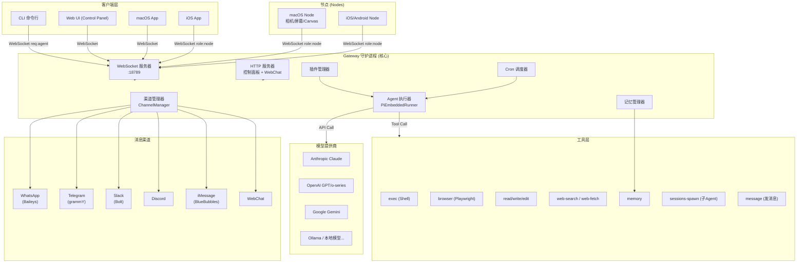

### 核心设计决策：一个 Gateway 掌管一切

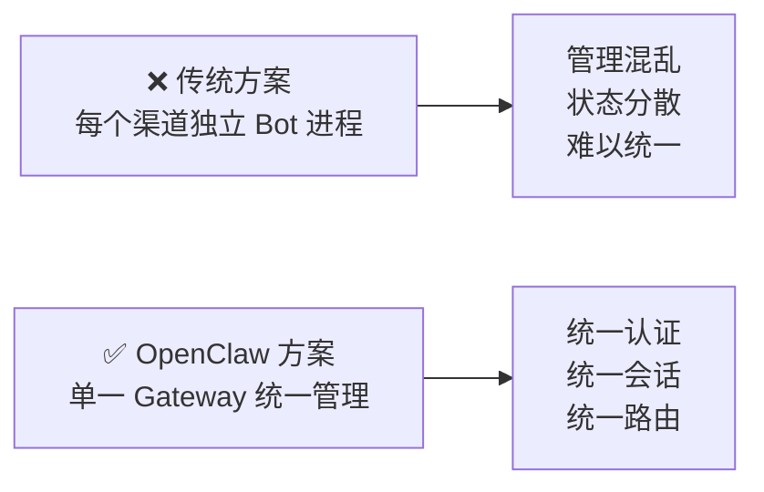

**好处**：
- 跨渠道统一身份（同一条消息可以从 WhatsApp 发，从 Telegram 看回复）
- 单点配置、单点鉴权
- 避免多个 WhatsApp Session 的竞争问题

---

## 3. 核心模块拆解

### 3.1 Gateway — 控制平面

**文件**：`src/gateway/server.impl.ts`

Gateway 是整个系统的**大脑和路由器**，负责：

1. 接受 WebSocket 连接（CLI、Web、macOS App、Node 设备）
2. 管理消息渠道的生命周期
3. 接收 `req:agent` 请求，派发给 Agent Runner
4. 将 Agent 流式结果通过 WebSocket 推回给客户端
5. 管理 Cron 定时任务

#### WebSocket 通信协议

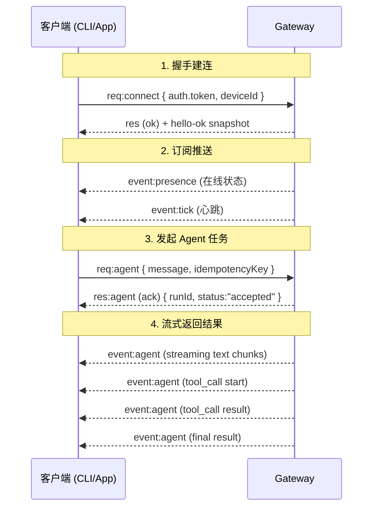

#### 协议消息格式

```typescript
// 请求格式
{ type: "req", id: "uuid", method: "agent", params: {...} }

// 响应格式
{ type: "res", id: "uuid", ok: true, payload: {...} }
{ type: "res", id: "uuid", ok: false, error: {...} }

// 服务器推送事件
{ type: "event", event: "agent", payload: {...}, seq: 42 }
```

#### Node 设备连接

**Nodes**（macOS/iOS/Android）是一类特殊客户端，连接时声明 `role: node`，可以提供额外能力：

```typescript
// Node 连接时的 caps 声明
{
  role: "node",
  caps: ["canvas.*", "camera.*", "screen.record", "location.get"],
  commands: [...],
  permissions: [...]
}
```

### 3.2 Agent Runner — 执行引擎

**文件**：`src/agents/pi-embedded-runner/run.ts` + `run/attempt.ts`

这是整个系统最核心的部分——**Agent 的 ReAct 循环**。

#### Agent 执行流程

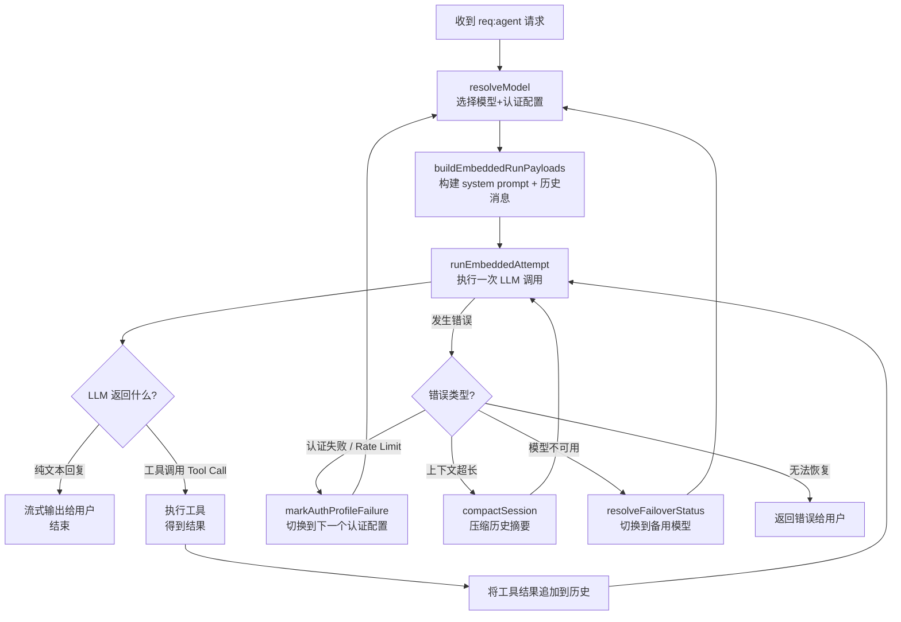

#### 关键设计：多层容错

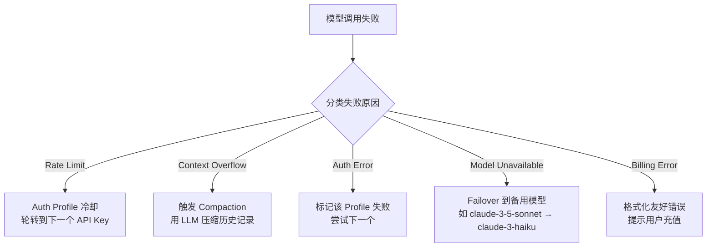

#### System Prompt 构建

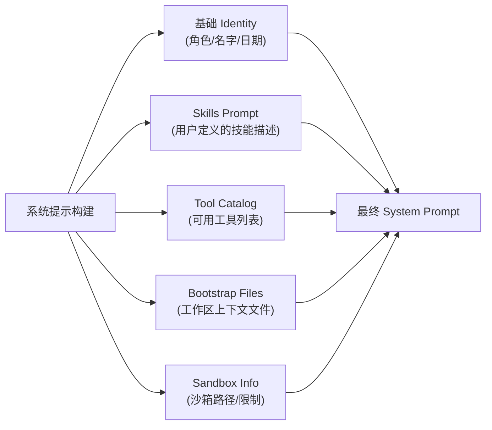

### 3.3 Tool System — 工具体系

**文件**：`src/agents/tools/` + `src/agents/tool-catalog.ts`

OpenClaw 的工具体系设计非常系统化，分为**工具定义**、**工具目录**、**工具策略**三层。

#### 工具分类（11 个 Section）

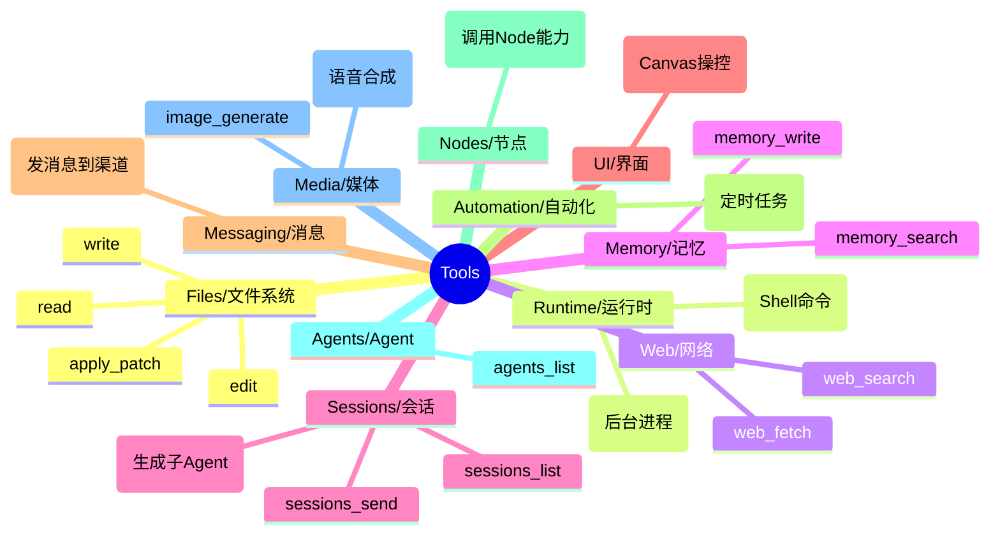

#### 工具策略（Tool Policy）

**文件**：`src/agents/tool-policy.ts`

```typescript
// 工具配置文件 (ToolProfileId)
type ToolProfileId = "minimal" | "coding" | "messaging" | "full"

// 每个 Profile 对应不同工具集
// minimal: 最少工具，适合简单问答
// coding:  文件系统 + 运行时 + Web
// messaging: 消息发送相关
// full:    全部工具
```

工具策略支持：
- **允许列表/拒绝列表**：精细控制哪些工具可用
- **分组**：`group:plugins`（所有插件工具）、`group:openclaw`（核心工具）
- **Owner-only**：某些高危工具只有 owner 用户可用
- **动态启用**：根据配置和用户权限动态调整

#### exec 工具（Shell 执行）的安全设计

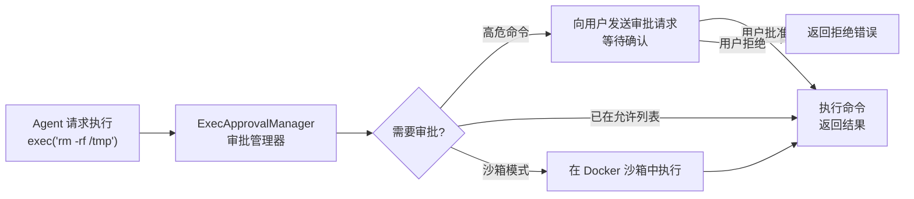

### 3.4 Channel System — 消息渠道

**文件**：`src/channels/` + `src/gateway/server-channels.ts`

每个消息渠道都是一个**插件化的渠道适配器**。

#### 渠道适配器模式

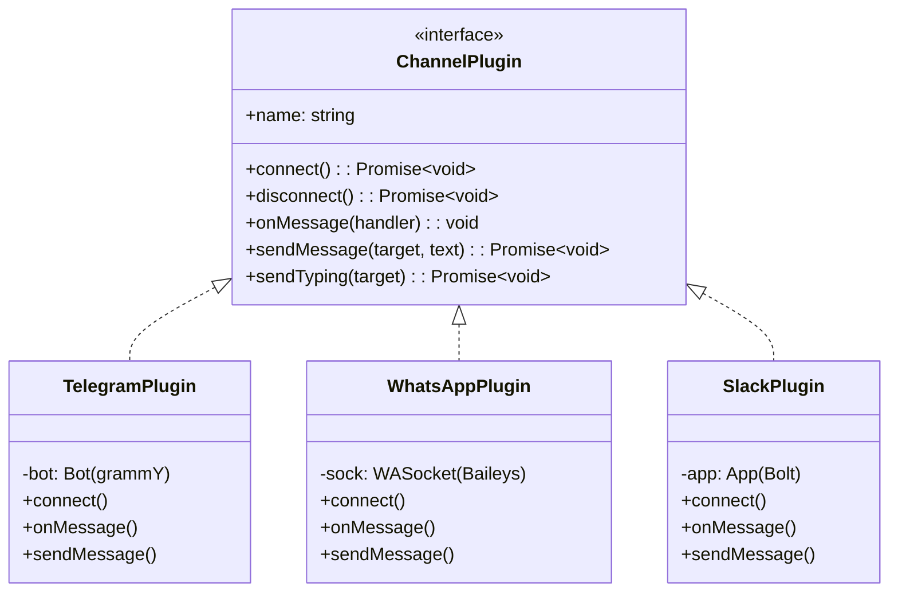

#### 消息路由流程

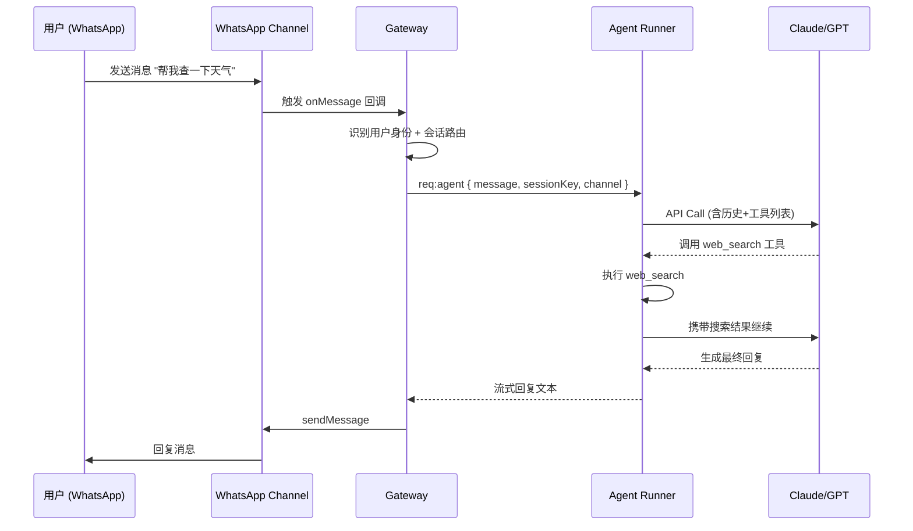

### 3.5 Plugin System — 插件机制

**文件**：`src/plugins/`

OpenClaw 的插件系统是**扩展能力而不膨胀 core** 的关键设计。

#### 插件 Hook 系统

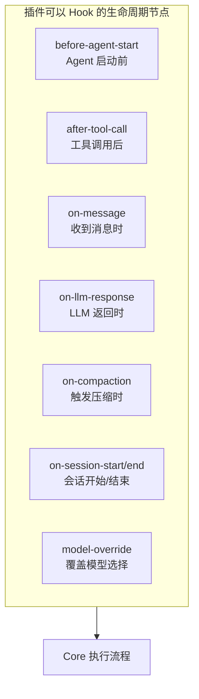

#### 插件能力范围

| 能力 | 说明 |
|------|------|
| 注册新工具 | 插件可以向 Agent 注册新的 Tool |
| 注册 CLI 命令 | 扩展 `openclaw` 命令行 |
| 注册 HTTP 端点 | 暴露自己的 API |
| Hook 生命周期 | 在关键节点插入自定义逻辑 |
| 注册 Gateway 方法 | 扩展 WebSocket 协议方法 |

#### 插件开发结构

```typescript
// 一个典型的 OpenClaw 插件
export default {
  name: "my-plugin",
  version: "1.0.0",

  // 注册工具
  tools: [
    {
      name: "my_custom_tool",
      description: "...",
      parameters: { /* JSON Schema */ },
      execute: async (params) => { /* 实现 */ }
    }
  ],

  // Hook 生命周期
  hooks: {
    "before-agent-start": async (ctx) => {
      // 在 Agent 启动前做点什么
    },
    "after-tool-call": async (ctx) => {
      // 工具调用后
    }
  },

  // 注册 HTTP 端点
  httpRoutes: [
    { method: "GET", path: "/my-endpoint", handler: async (req, res) => {} }
  ]
}
```

### 3.6 Skills System — 技能系统

**文件**：`src/agents/skills/`

Skills 是一种**可动态加载的 Prompt 增强机制**，本质是 Markdown 文件，注入到 System Prompt 中。

#### Skills 层级

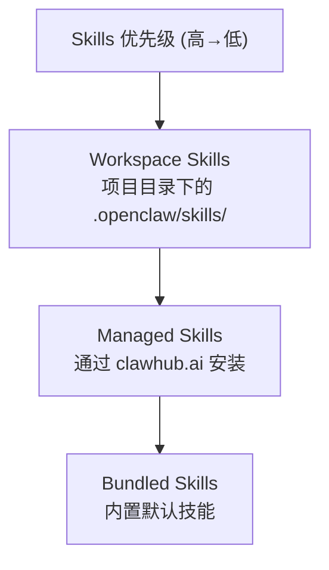

#### Skills 工作原理

```
SKILLS_DIR/
├── coding.md        # 编程相关技能描述
├── web-research.md  # 网页研究技能
└── custom.md        # 用户自定义

↓ 构建 System Prompt 时

[System Prompt]
...
## Skills
### coding
你擅长编写干净、可维护的代码...

### web-research
当用户询问需要查找信息的问题时...
```

### 3.7 Memory System — 记忆系统

**文件**：`src/agents/memory-search.ts` + `src/agents/tools/memory-tool.ts`

OpenClaw 的记忆系统是**单插槽设计**——同时只能启用一个记忆插件。

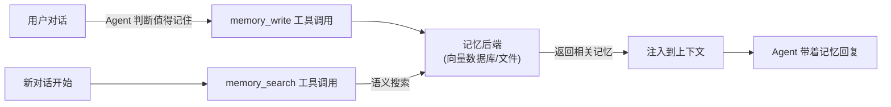

支持的记忆后端（通过插件）：
- **文件系统**：本地 JSON/向量文件（内置默认）
- **向量数据库**：通过插件扩展（如 Qdrant、Chroma）

### 3.8 Multi-Model — 多模型管理

**文件**：`src/agents/model-auth.ts` + `src/agents/model-fallback.ts` + `src/agents/auth-profiles.ts`

这是 OpenClaw 中非常精心设计的一个模块，解决了**多 API Key 轮转 + 模型故障转移**的问题。

#### Auth Profile 轮转机制

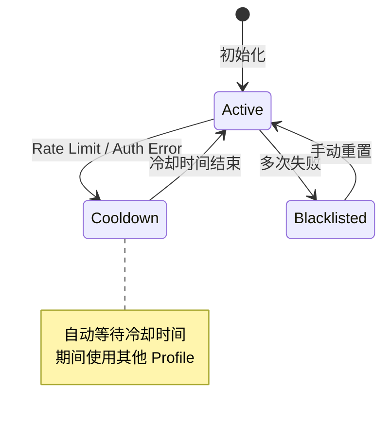

#### 模型故障转移链

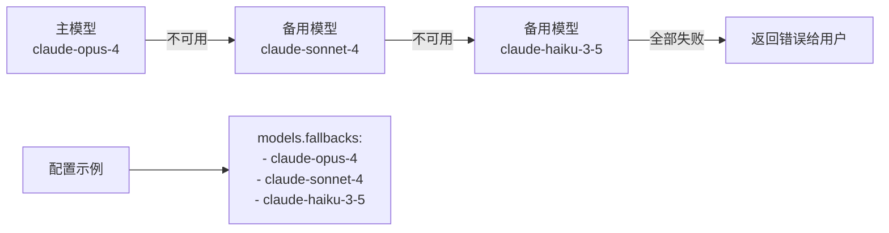

#### 支持的模型提供商

| 提供商 | 认证方式 |
|--------|----------|
| Anthropic | API Key / OAuth (Claude Pro/Max) |
| OpenAI | API Key / OAuth (ChatGPT Plus) |
| Google Gemini | API Key |
| Ollama | 本地无需认证 |
| AWS Bedrock | AWS 凭证 |
| Azure OpenAI | API Key + Endpoint |
| Cloudflare AI | API Key |
| HuggingFace | API Key |
| BytePlus/Volcengine | API Key |
| 以及更多... | |

### 3.9 Subagent System — 子 Agent 系统

**文件**：`src/agents/tools/sessions-spawn-tool.ts` + `src/agents/subagent-registry.ts`

OpenClaw 支持 Agent 动态生成子 Agent（类似 CrewAI / AutoGen），实现并行/串行任务分解。

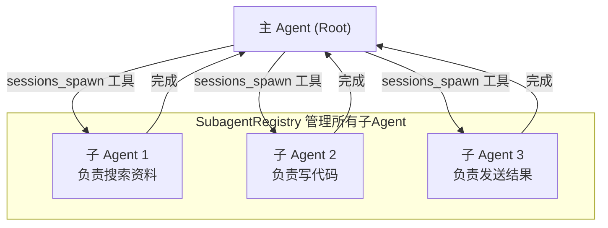

#### 子 Agent 设计要点

- **深度限制**：防止无限递归创建子 Agent（默认最大深度 3）
- **超时控制**：每个子 Agent 有独立超时
- **结果汇总**：父 Agent 等待子 Agent 完成后继续
- **Steer（引导）**：可以向运行中的子 Agent 发送指令
- **线程 ID**：子 Agent 继承父 Agent 的会话上下文

---

## 4. 关键数据流

### 4.1 完整的消息处理流程

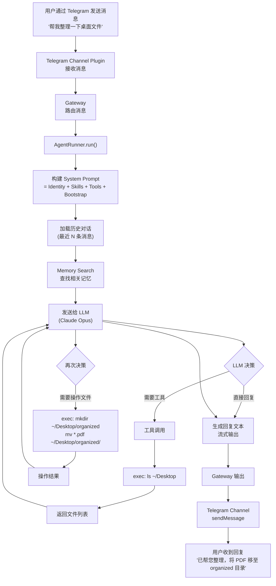

### 4.2 多渠道会话隔离

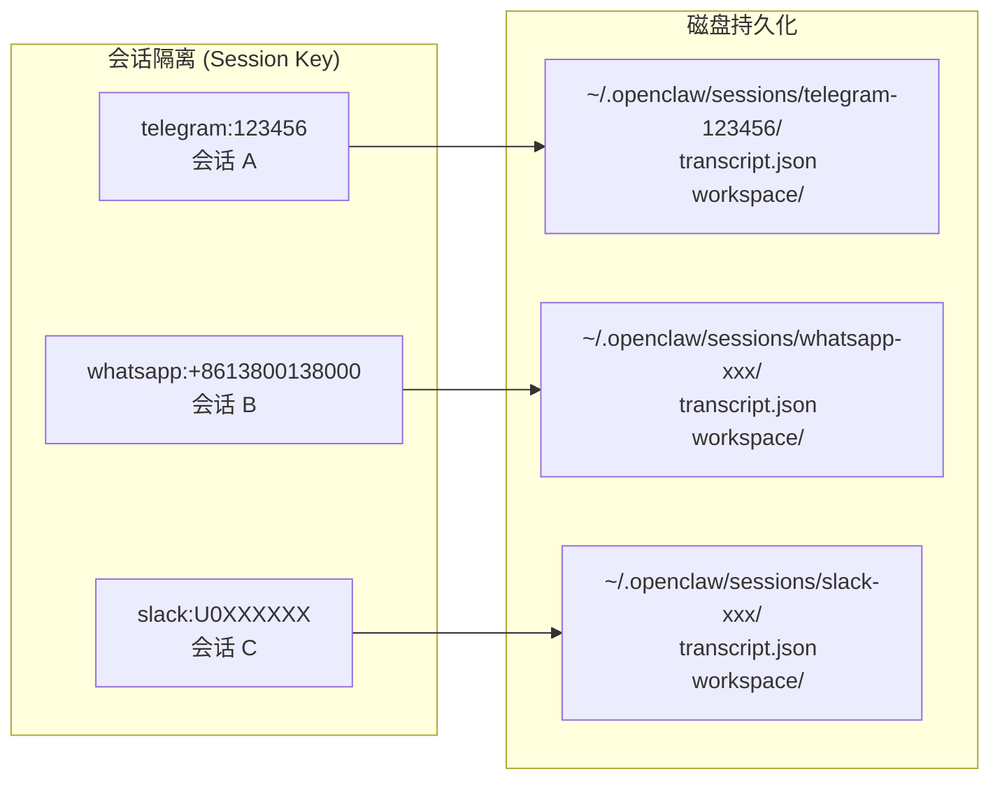

---

## 5. 安全设计

OpenClaw 在安全上投入了大量精力，核心思路是：**强默认 + 清晰的危险路径**。

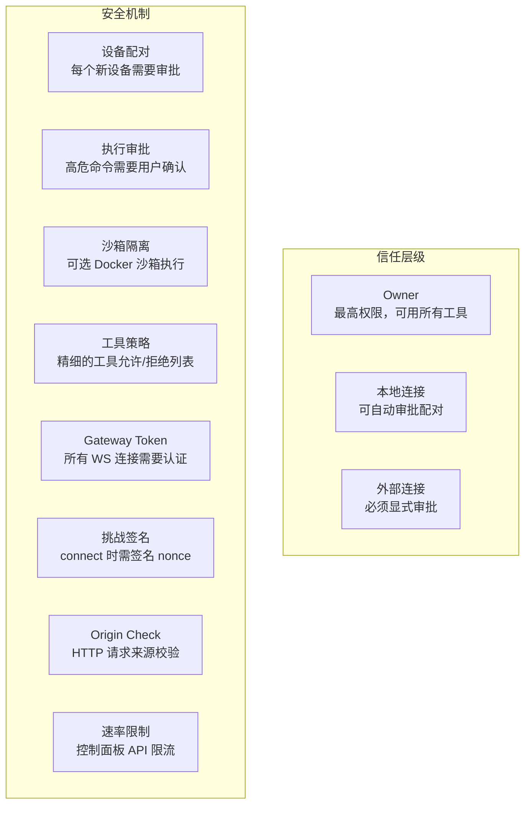

### 沙箱执行架构

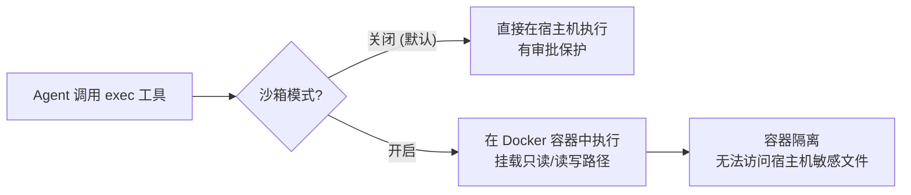

---

## 6. 技术选型分析

| 模块 | 选型 | 原因 |
|------|------|------|
| 运行时 | Node.js ≥22 | 原生 WebSocket、好的异步模型 |
| 语言 | TypeScript | 易读易改，类型安全，社区大 |
| 构建工具 | tsdown (Rollup) | 快速 ESM bundle |
| 包管理 | pnpm monorepo | workspace 多包管理 |
| WhatsApp | @whiskeysockets/baileys | 唯一可靠的 WA 非官方库 |
| Telegram | grammy | 现代 TypeScript-first Bot 框架 |
| Slack | @slack/bolt | 官方 SDK |
| WebSocket | ws | 轻量，Node 原生友好 |
| HTTP | express 5 | 成熟，插件生态好 |
| 浏览器控制 | playwright-core | 最强大的浏览器自动化 |
| 数据验证 | zod 4 | TypeScript-first 验证 |
| 测试 | vitest | 快速，ESM 原生支持 |

---

## 7. 复刻路线图

如果你要从头复刻一个类似系统，推荐按以下顺序进行：

```mermaid
gantt
    title 复刻路线图（从简到复杂）
    dateFormat  X
    axisFormat  Phase %s

    section Phase 1 核心骨架
    Agent Runner (ReAct Loop)    :done, p1a, 0, 2
    基础工具 (exec/read/write)   :done, p1b, 0, 2
    CLI 接口                     :done, p1c, 1, 2

    section Phase 2 Gateway
    WebSocket 服务器             :p2a, 2, 4
    基础 Wire 协议               :p2b, 2, 4
    会话管理                     :p2c, 3, 4

    section Phase 3 渠道
    一个渠道适配器 (如Telegram)  :p3a, 4, 6
    渠道插件接口抽象             :p3b, 5, 6
    更多渠道...                  :p3c, 6, 8

    section Phase 4 增强
    多模型+故障转移              :p4a, 6, 8
    插件系统                     :p4b, 7, 9
    记忆系统                     :p4c, 8, 10
    子 Agent                     :p4d, 9, 10
```

### 最小可行版本（MVP）架构建议

对于自研版本，推荐以下精简架构：

```mermaid
graph TB
    subgraph MVP["你的 MVP 架构"]
        CLI2["CLI 入口\n(Commander.js)"]
        Loop["Agent Loop\n(ReAct)"]
        Tools2["工具集\nexec/read/write/web-search"]
        Models2["模型适配层\n(Anthropic/OpenAI SDK)"]
        Session2["会话存储\n(JSON 文件)"]
        Channel2["单渠道\n(Telegram)"]
    end

    CLI2 --> Loop
    Loop --> Tools2
    Loop --> Models2
    Loop --> Session2
    Channel2 --> Loop
```

### 关键代码模式参考

#### 1. ReAct Agent 循环骨架

```typescript
async function runAgentLoop(params: AgentParams) {
  const messages: Message[] = [
    { role: "system", content: buildSystemPrompt(params) },
    ...params.history,
    { role: "user", content: params.userMessage }
  ];

  while (true) {
    const response = await llm.call({ messages, tools });

    if (response.stop_reason === "end_turn") {
      // 纯文本回复，结束
      yield { type: "text", content: response.text };
      break;
    }

    if (response.stop_reason === "tool_use") {
      // 执行工具
      for (const toolCall of response.tool_calls) {
        yield { type: "tool_start", name: toolCall.name };
        const result = await executeTool(toolCall);
        yield { type: "tool_result", result };

        messages.push({ role: "assistant", content: response.content });
        messages.push({ role: "user", content: [{ type: "tool_result", ...result }] });
      }
      // 继续循环
    }
  }
}
```

#### 2. 工具定义接口

```typescript
interface Tool<P = Record<string, unknown>> {
  name: string;
  description: string;
  parameters: JSONSchema;
  execute(params: P, context: ToolContext): Promise<ToolResult>;
}

interface ToolContext {
  sessionId: string;
  userId: string;
  workspaceDir: string;
  signal: AbortSignal;  // 支持取消
}

interface ToolResult {
  content: string | object;
  isError?: boolean;
}
```

#### 3. 渠道适配器接口

```typescript
interface ChannelAdapter {
  name: string;
  start(): Promise<void>;
  stop(): Promise<void>;
  onMessage(handler: MessageHandler): void;
  sendText(target: string, text: string): Promise<void>;
  sendTyping(target: string): Promise<void>;
}

type MessageHandler = (event: IncomingMessage) => Promise<void>;

interface IncomingMessage {
  channelId: string;    // "telegram"
  chatId: string;       // 用户/群组 ID
  userId: string;       // 发消息的人
  text: string;
  attachments?: Attachment[];
}
```

### 重要经验总结

1. **会话 Key 设计要早**：`{channel}:{chatId}` 格式，决定了多渠道隔离粒度
2. **Tool Result 截断要考虑**：Shell 命令输出可能很长，需要限制 token 数
3. **Auth Profile 轮转是刚需**：生产中 Rate Limit 很常见，多 Key 轮转必须设计
4. **Compaction 要做**：长对话会超出上下文窗口，需要摘要压缩历史
5. **WebSocket 协议幂等性**：`idempotencyKey` 防止网络抖动导致重复执行
6. **工具审批体验**：危险操作要给用户审批机会，否则用户不敢用
7. **节点设计解耦**：把需要原生能力（摄像头、屏幕）的部分独立为 Node，通过协议通信

---

*文档生成时间：2026-02-26*
*分析基于 OpenClaw v2026.2.25 源码*
*仓库：https://github.com/openclaw/openclaw*
