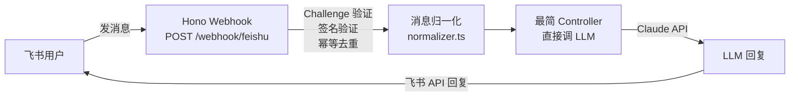
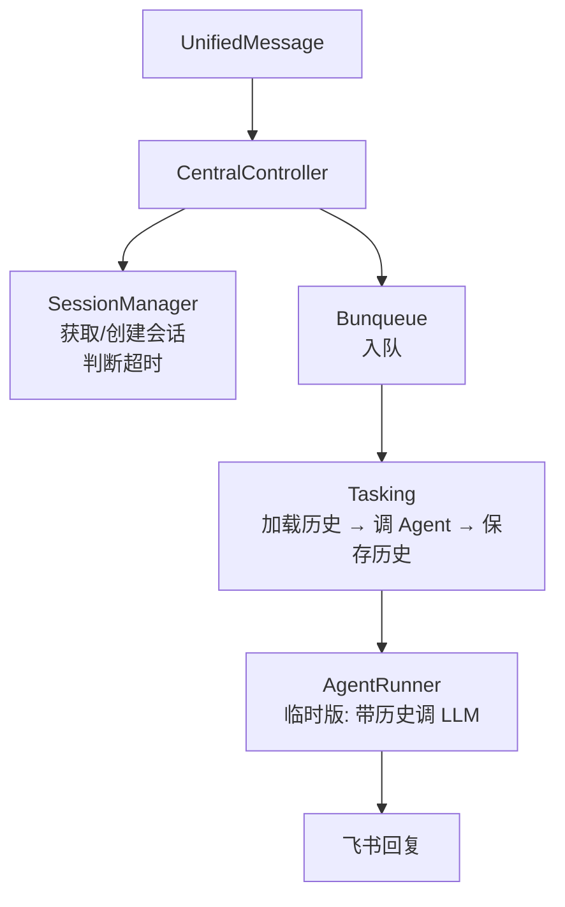
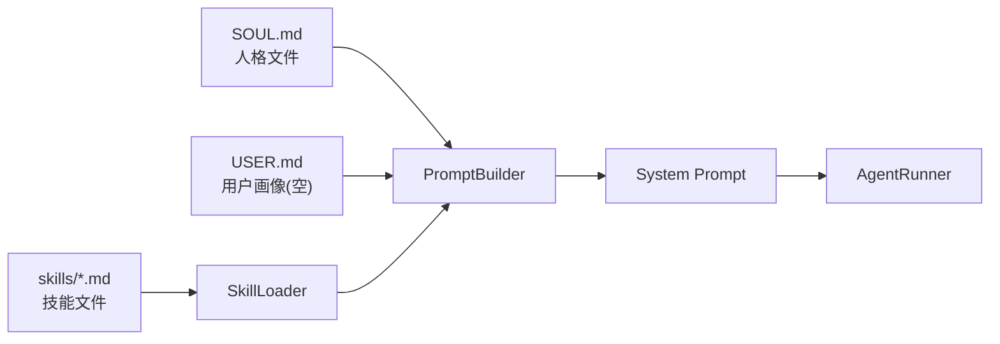
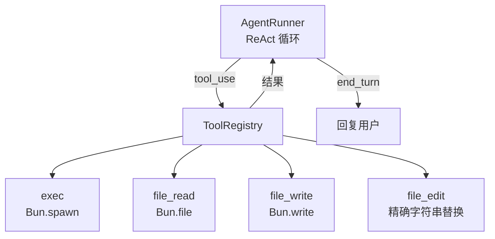
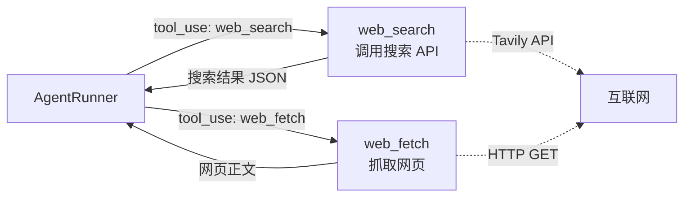
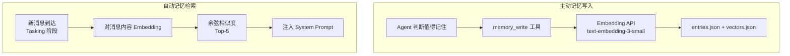

# ClawBot 七天开发计划

> 指导思想：**每一天结束时，都能在飞书里体验到真实的新进展**。
> 不追求完美，先让每层骨架跑通，再回头补细节。

---

## 全局进度总览

```mermaid
gantt
    title ClawBot 7天开发路线
    dateFormat  D
    axisFormat  Day %d

    section Day 1 接通飞书
    项目骨架 + Hono + PM2           :d1a, 1, 1
    飞书 Webhook + Token + 回复     :d1b, 1, 1
    最简 LLM 直接调用               :d1c, 1, 1

    section Day 2 连续对话
    全局类型定义                    :d2a, 2, 2
    User-Space 初始化               :d2b, 2, 2
    SessionManager + 会话历史       :d2c, 2, 2
    Bunqueue + CentralController    :d2d, 2, 2

    section Day 3 人格上线
    PromptBuilder                   :d3a, 3, 3
    SOUL.md 人格注入                :d3b, 3, 3
    SkillLoader + Skills 文件       :d3c, 3, 3

    section Day 4 真正干活
    ToolRegistry + ReAct 循环       :d4a, 4, 4
    exec 工具                       :d4b, 4, 4
    file_read / write / edit 工具   :d4c, 4, 4

    section Day 5 联网搜索
    web_search 工具                 :d5a, 5, 5
    web_fetch 工具                  :d5b, 5, 5

    section Day 6 拥有记忆
    Embedding + VectorStore         :d6a, 6, 6
    MemoryManager                   :d6b, 6, 6
    memory 工具 + 自动检索注入      :d6c, 6, 6

    section Day 7 认识你了
    HookBus + after-agent Hook      :d7a, 7, 7
    USER.md 用户画像自动更新        :d7b, 7, 7
    多模型容错 + Compaction         :d7c, 7, 7
    插件骨架 + 系统稳定化           :d7d, 7, 7
```



---

## Day 1 — 接通飞书，跑通第一句对话

### 今日里程碑
> **在飞书里发一条消息，Bot 能智能回复**

### 飞书体验
- 私聊机器人发「你好」→ 收到 LLM 的智能回复
- 发任何问题都能得到回答
- 消息格式正确（不是乱码或报错）

### 需要实现的模块



### 今日任务清单

**1. 项目初始化**
- [ ] `bun init` 创建项目，配置 `tsconfig.json`
- [ ] 安装依赖：`hono`、`zod`、`@anthropic-ai/sdk`、`pino`
- [ ] 创建 `config.yaml` + `.env` 结构
- [ ] 配置 `ecosystem.config.js`（PM2）

**2. Gateway 层**（`src/gateway/`）
- [ ] `index.ts`：启动 Hono HTTP Server，监听 `:3000`
- [ ] `feishu-webhook.ts`：
  - URL Verification（Challenge 握手）
  - 签名验证（Verification Token）
  - 幂等去重（内存 Map 缓存 event_id，5分钟 TTL）
  - fire-and-forget 派发消息
- [ ] `feishu-api.ts`：
  - `getTenantAccessToken()`（带缓存，token 2 小时过期）
  - `replyMessage(messageId, text)`
- [ ] `normalizer.ts`：飞书 Event → `UnifiedMessage`（只处理 `text` 类型）

**3. 最简 Kernel（今日临时版）**
- [ ] `src/index.ts`：启动入口，初始化 Gateway
- [ ] 收到消息后直接调 LLM，拿到回复后调飞书 API 回复（无历史、无队列）

**4. 最简 ModelRouter（今日临时版）**
- [ ] 单模型单 API Key，直接调 Anthropic SDK
- [ ] 只需能跑通，不需要容错

**5. 本地调试**
- [ ] 用 `ngrok` 或内网穿透工具暴露本地端口
- [ ] 飞书开放平台配置 Webhook URL 并验证

### 涉及文件
```
src/
├── index.ts                    # 启动入口
├── gateway/
│   ├── index.ts                # Hono 服务
│   ├── feishu-webhook.ts       # Webhook 处理
│   ├── feishu-api.ts           # 飞书 API 封装
│   └── normalizer.ts           # 消息归一化
└── shared/
    ├── config.ts               # 配置加载
    └── logger.ts               # pino 日志
config.yaml
.env
ecosystem.config.js
```

### 验收标准
- [ ] 飞书发「你好」→ Bot 3秒内回复
- [ ] `bun run dev` 启动无报错
- [ ] PM2 `pm2 start ecosystem.config.js` 能正常守护进程
- [ ] 飞书开放平台 Webhook 配置验证通过（Challenge 握手成功）

---

## Day 2 — 会说话，还能记住

### 今日里程碑
> **多轮对话，上下文连贯；重启服务后历史依然在**

### 飞书体验
- 连续问三个问题，Bot 记得前面说了什么
- 问「我刚才说了什么？」→ Bot 能准确回忆
- 关掉服务重启后，再聊还有上次的记忆

### 需要实现的模块



### 今日任务清单

**1. 类型系统**
- [ ] `src/shared/types.ts`：补全所有核心类型（`UnifiedMessage`、`Session`、`Message`、`AgentContext`、`AgentResult`、`AgentTask`）

**2. User-Space 初始化**
- [ ] `src/shared/utils.ts`：`initUserSpace(userId)` — 首次用户消息时自动创建目录结构

**3. SessionManager**（`src/kernel/session-manager.ts`）
- [ ] `getOrCreate(userId)`：30分钟超时判断
- [ ] `getHistory(userId, sessionId)`：从 JSON 文件读取
- [ ] `appendHistory(userId, sessionId, userMsg, agentResult)`：追加并持久化

**4. Bunqueue 接入**（`src/kernel/scheduling.ts`）
- [ ] 安装 `bunqueue`
- [ ] `Scheduling` 类：`enqueue(task)` + `concurrency: 2` + 防重复 key

**5. Tasking（基础版）**（`src/kernel/tasking.ts`）
- [ ] `execute(task)` 流程：
  1. 加载会话历史
  2. 组装 `AgentContext`（此时只有历史，无 SOUL/Skills/Memory）
  3. 调 `AgentRunner.run()`
  4. 保存历史
  5. 回复用户

**6. CentralController 重构**（`src/kernel/central-controller.ts`）
- [ ] 群聊 @Bot 过滤
- [ ] `dispatch()` 改为走 Bunqueue 入队

**7. AgentRunner（带历史版）**（`src/agents/runner.ts`）
- [ ] 传入 `history`，拼接进 messages 数组
- [ ] 只支持 `end_turn`（纯文本），暂不支持 tool_use

### 涉及文件
```
src/
├── kernel/
│   ├── central-controller.ts   # 重写，走队列
│   ├── scheduling.ts           # 新增，Bunqueue
│   ├── tasking.ts              # 新增，基础版
│   └── session-manager.ts      # 新增
├── agents/
│   └── runner.ts               # 新增，带历史版
└── shared/
    ├── types.ts                # 完善
    └── utils.ts                # initUserSpace
data/users/{userId}/sessions/   # 运行时自动创建
```

### 验收标准
- [ ] 多轮对话上下文连贯
- [ ] `data/users/{userId}/sessions/{id}.json` 文件正确写入
- [ ] 服务重启后继续上次对话
- [ ] 30分钟无消息后，新消息开启新会话

---

## Day 3 — 有了灵魂

### 今日里程碑
> **Bot 有了名字和人格，说话有自己的风格**

### 飞书体验
- 问「你叫什么名字？」→ 她有自己的名字和自我介绍
- 她的回答风格和 Day 2 明显不同（有性格了）
- 问「你有什么能力？」→ 她能说出自己的 Skills

### 需要实现的模块



### 今日任务清单

**1. 默认 SOUL.md**
- [ ] 创建 `data/shared/defaults/SOUL.md`（Bot 的默认人格）
- [ ] 为自己创建 `data/users/{你的open_id}/SOUL.md`（个性化人格）
- [ ] `initUserSpace()` 补全：自动复制默认 SOUL.md

**2. SkillLoader**（`src/skills/skill-loader.ts`）
- [ ] `loadGlobal()`：扫描 `data/shared/skills/*.md`
- [ ] `loadUser(userId)`：扫描 `data/users/{id}/skills/*.md`
- [ ] 用户技能同名时覆盖全局技能

**3. 全局 Skills 文件**
- [ ] `data/shared/skills/default.md`：通用行为准则
- [ ] `data/shared/skills/coding.md`：编程技能描述

**4. PromptBuilder**（`src/agents/prompt-builder.ts`）
- [ ] `build(context)`：拼接以下段落：
  - `# 身份`（名字 + 当前时间）
  - `# 人格设定`（SOUL.md 内容）
  - `# 关于你`（USER.md 内容，此时为空）
  - `# 技能`（Skills 内容）

**5. Tasking 补全**
- [ ] 加载 `SOUL.md` 和 `USER.md`
- [ ] 加载 Global + User Skills
- [ ] 将 soul、userProfile、skills 传入 AgentContext

### 涉及文件
```
src/
├── skills/
│   └── skill-loader.ts         # 新增
└── agents/
    └── prompt-builder.ts       # 新增
data/
├── shared/
│   ├── defaults/
│   │   └── SOUL.md             # 新增，默认人格
│   └── skills/
│       ├── default.md          # 新增
│       └── coding.md           # 新增
└── users/{id}/
    └── SOUL.md                 # 新增，个人人格
```

### 验收标准
- [ ] 飞书问「你叫什么名字」→ Bot 用 SOUL.md 中的名字回答
- [ ] 修改 SOUL.md，重启服务后 Bot 风格改变
- [ ] 增加一个 skill 文件，Bot 能按 skill 描述行事

---

## Day 4 — 真正能干活

### 今日里程碑
> **Bot 能执行 Shell 命令、创建和编辑文件**

### 飞书体验
- 「在 workspace 里帮我创建一个 hello.txt，内容是 Hello World」→ 真的创建了
- 「帮我查一下当前目录下有哪些文件」→ Bot 执行 `ls` 并返回结果
- 「把刚才那个文件里的 Hello 改成 Hi」→ Bot 用 file_edit 工具改好了

### 需要实现的模块



### 今日任务清单

**1. ToolRegistry**（`src/tools/registry.ts`）
- [ ] `register(tool)`
- [ ] `execute(name, params, context)`（带 try/catch 错误兜底）
- [ ] `toLLMTools()`（转换为 Anthropic tool schema 格式）

**2. exec 工具**（`src/tools/exec.ts`）
- [ ] `Bun.spawn(["sh", "-c", command])` 执行
- [ ] stdout + stderr 合并
- [ ] 超时控制（默认 30s）
- [ ] `cwd` 默认为用户 workspace 目录
- [ ] 输出截断（最大 8000 字符）

**3. 文件工具**（`src/tools/file-*.ts`）
- [ ] `file_read`：读取文件内容，超长截断
- [ ] `file_write`：写入文件（自动创建目录）
- [ ] `file_edit`：精确字符串替换（`old_string` → `new_string`）

**4. AgentRunner 完整版 ReAct 循环**（`src/agents/runner.ts`）
- [ ] 支持 `tool_use`：循环执行工具 → 追加结果 → 继续
- [ ] `MAX_TOOL_ROUNDS = 20` 防无限循环
- [ ] 工具结果截断（`truncateResult`）
- [ ] 基础错误处理（catch 后返回错误文字）

**5. Tasking 补全**
- [ ] 传入 `toolRegistry.getAvailableTools()` 到 AgentContext
- [ ] AgentRunner 调用时传入工具列表

### 涉及文件
```
src/
├── tools/
│   ├── registry.ts             # 新增
│   ├── exec.ts                 # 新增
│   ├── file-read.ts            # 新增
│   ├── file-write.ts           # 新增
│   └── file-edit.ts            # 新增
└── agents/
    └── runner.ts               # 重写，完整 ReAct 循环
```

### 验收标准
- [ ] 「帮我在 workspace 创建 test.txt」→ 文件真实存在
- [ ] 「执行 date 命令」→ 返回当前时间
- [ ] 「把文件里的 xxx 改成 yyy」→ 内容被正确修改
- [ ] 工具调用出错时，Bot 能告知用户而不是崩溃

---

## Day 5 — 能上网了

### 今日里程碑
> **Bot 能联网搜索最新信息、抓取网页内容**

### 飞书体验
- 「最近 Claude 有什么新消息」→ Bot 搜索后总结
- 「帮我看看 bun.sh 上最新的博客说了什么」→ Bot 抓取并解读
- 「今天的 AI 行业新闻有哪些」→ 真实的最新结果

### 需要实现的模块



### 今日任务清单

**1. web_search 工具**（`src/tools/web-search.ts`）
- [ ] 选择搜索 API（推荐 **Tavily** — 专为 LLM 设计，结果干净）
  - 备选：Exa、SerpAPI、Brave Search
- [ ] 安装 `@tavily/core`
- [ ] 返回格式：标题 + URL + 摘要的列表
- [ ] 结果数量：默认 5 条，截断到 3000 字

**2. web_fetch 工具**（`src/tools/web-fetch.ts`）
- [ ] 直接 `fetch(url)`
- [ ] HTML → 纯文本提取（去除 script/style/nav 等标签）
- [ ] 内容截断（最大 10000 字）
- [ ] 超时 10s

**3. 在 ToolRegistry 中注册**
- [ ] 注册 `web_search` 和 `web_fetch` 两个工具

**4. config.yaml 补充**
- [ ] 增加 `search.apiKey` 字段

### 涉及文件
```
src/tools/
├── web-search.ts               # 新增
└── web-fetch.ts                # 新增
config.yaml                     # 补充 search 配置
.env                            # 补充 TAVILY_API_KEY
```

### 验收标准
- [ ] 「2026年的 AI 大模型进展」→ Bot 调用 web_search 并总结
- [ ] 指定一个 URL → Bot 能抓取并解读内容
- [ ] 网页超长时能正常截断不崩溃
- [ ] 搜索 API key 失效时 Bot 能优雅提示

---

## Day 6 — 有了真正的记忆

### 今日里程碑
> **跨会话记忆：告诉 Bot 一件事，下次新对话她还记得**

### 飞书体验
- 告诉 Bot「记住：我不喜欢废话，回答要简洁」→ 她说「好的，已记住」
- 关闭对话，30分钟后新开一个会话
- 问「你还记得我之前说的偏好吗？」→ 她能说出来
- 自然对话中她也会主动想起相关记忆

### 需要实现的模块



### 今日任务清单

**1. Embedding 模块**（`src/memory/embedding.ts`）
- [ ] 接入 OpenAI `text-embedding-3-small`（便宜，维度 1536）
- [ ] `embed(text): Promise<number[]>`
- [ ] 带缓存（相同文本不重复调用）

**2. VectorStore**（`src/memory/vector-store.ts`）
- [ ] 本地文件存储（`vectors.json`）
- [ ] `add(id, vector)`
- [ ] `search(queryVector, topK)`：余弦相似度计算 + Top-K 排序
- [ ] `cosine_similarity(a, b)`

**3. MemoryManager**（`src/memory/memory-manager.ts`）
- [ ] `write(userId, entry)`：写条目 + 生成向量 + 存储
- [ ] `search(userId, query, topK)`：先 embed 再向量检索

**4. 记忆工具**
- [ ] `memory_write`（`src/tools/memory-write.ts`）：Agent 主动调用
- [ ] `memory_read`（`src/tools/memory-read.ts`）：Agent 主动检索（辅助用）
- [ ] 注册到 ToolRegistry

**5. Tasking 补全：自动记忆注入**
- [ ] 每次任务开始前，调 `memoryManager.search(userId, message.text)`
- [ ] 将结果作为 `memories` 传入 `AgentContext`

**6. PromptBuilder 补全**
- [ ] 注入 `# 相关记忆` 段落

**7. SOUL.md 中补充记忆使用说明**
- [ ] 告诉 Bot：当用户明确要求记住某事时，调用 `memory_write` 工具

### 涉及文件
```
src/
├── memory/
│   ├── memory-manager.ts       # 新增
│   ├── embedding.ts            # 新增
│   └── vector-store.ts         # 新增
└── tools/
    ├── memory-write.ts         # 新增
    └── memory-read.ts          # 新增
.env                            # 补充 OPENAI_API_KEY (embedding用)
```

### 验收标准
- [ ] 「记住：我是一个 TypeScript 开发者」→ `entries.json` 中有对应记录
- [ ] 新建会话，问「你知道我是做什么的吗？」→ 她知道
- [ ] `data/users/{id}/memory/entries.json` 内容正确
- [ ] `data/users/{id}/memory/vectors.json` 有对应向量

---

## Day 7 — 认识你了，系统稳定化

### 今日里程碑
> **Bot 会主动认识你、USER.md 自动积累画像；系统具备完整容错能力**

### 飞书体验
- 聊了几轮后，打开 `data/users/{id}/USER.md`，能看到 Bot 自动总结了你的信息
- 故意让 Bot 调用失败的工具 → 她能优雅报错不崩溃
- 发很长的消息导致 context 超长 → 自动压缩不报错
- API key 无效或超速 → 自动切换备用

### 需要实现的模块


### 今日任务清单

**1. HookBus**（`src/plugins/hook-bus.ts`）
- [ ] 事件注册：`on(event, handler)`
- [ ] 事件触发：`emit(event, ctx)`
- [ ] 支持的 Hook：`on-message` / `before-agent` / `after-tool-call` / `after-agent` / `on-error`

**2. USER.md 自动画像**（`src/memory/user-profile.ts`）
- [ ] 在 `after-agent` Hook 中触发
- [ ] 每 **5 次**对话触发一次（不是每次都触发，避免消耗太多 token）
- [ ] 用轻量模型（`claude-haiku`）分析最近对话，提取用户特征
- [ ] 追加到 `USER.md`（不覆盖，只追加新发现的内容）

**3. ModelRouter 完整版**（`src/agents/model-router.ts`）
- [ ] 多 API Key 轮转（`AuthProfile` 数组）
- [ ] Rate Limit → 标记冷却 60s → 切换下一个 key
- [ ] Model Unavailable → Failover 到 `fallbacks` 链
- [ ] 全部失败 → 抛出用户友好的错误

**4. Compaction**（`src/agents/compaction.ts`）
- [ ] 检测 Context Overflow 错误
- [ ] 用 LLM 将长历史压缩为摘要
- [ ] 保留最近 3 轮完整对话 + 摘要

**5. Plugin System 骨架**（`src/plugins/plugin-manager.ts`）
- [ ] `PluginManager` 类：`register(plugin)` + `loadAll()`
- [ ] 插件能注册工具、Hook、HTTP 路由
- [ ] 内置 Cron Plugin 骨架（不需要完整实现，有骨架即可）

**6. 全局错误处理**
- [ ] AgentRunner 中所有 unhandled error → 飞书发友好提示
- [ ] Gateway Webhook 处理中的异常不能崩溃整个进程
- [ ] PM2 `max_memory_restart` 兜底

**7. 整体收尾**
- [ ] 检查所有 TODO 和 `// 临时版` 注释，能修则修
- [ ] `data/shared/defaults/SOUL.md` 写一版完整的人格文件
- [ ] `README.md`：写清楚如何启动项目

### 涉及文件
```
src/
├── plugins/
│   ├── hook-bus.ts             # 新增
│   ├── plugin-manager.ts       # 新增
│   └── builtin/
│       └── cron-plugin.ts      # 新增（骨架）
├── memory/
│   └── user-profile.ts         # 新增
└── agents/
    ├── model-router.ts         # 完整版
    └── compaction.ts           # 新增
README.md                       # 补全
```

### 验收标准
- [ ] 对话 5 次后，`USER.md` 有自动更新的内容
- [ ] 故意发超长消息 → Compaction 自动触发，不报错
- [ ] 断开 API Key → 自动切换备用，飞书里不出现崩溃
- [ ] `pm2 logs clawbot` 日志清晰可读
- [ ] README 能让另一个人按文档跑起来

---

## 七天功能积累总览

| 功能 | Day 1 | Day 2 | Day 3 | Day 4 | Day 5 | Day 6 | Day 7 |
|------|:-----:|:-----:|:-----:|:-----:|:-----:|:-----:|:-----:|
| 飞书收发消息 | ✅ | ✅ | ✅ | ✅ | ✅ | ✅ | ✅ |
| 多轮对话历史 | | ✅ | ✅ | ✅ | ✅ | ✅ | ✅ |
| 异步任务队列 | | ✅ | ✅ | ✅ | ✅ | ✅ | ✅ |
| Bot 人格 SOUL.md | | | ✅ | ✅ | ✅ | ✅ | ✅ |
| Skills 技能注入 | | | ✅ | ✅ | ✅ | ✅ | ✅ |
| exec 工具 | | | | ✅ | ✅ | ✅ | ✅ |
| 文件操作工具 | | | | ✅ | ✅ | ✅ | ✅ |
| 网络搜索工具 | | | | | ✅ | ✅ | ✅ |
| 跨会话记忆 | | | | | | ✅ | ✅ |
| 用户画像 USER.md | | | | | | | ✅ |
| 多模型容错 | | | | | | | ✅ |
| Context 压缩 | | | | | | | ✅ |
| 插件系统骨架 | | | | | | | ✅ |

---

## 每天开始前的检查清单

在每天开始写代码之前，先做这三件事：

1. **验证昨天的成果**：在飞书里测试一下昨天完成的功能，确保没有被今天的改动破坏
2. **本地跑通**：`bun run dev` 无报错
3. **看一眼今日 SOUL.md**：有时候一个好的人格描述能让整天的体验质量提升很多

---

*文档版本：v0.1*
*基于 ClawBot技术方案.md 拆解*
*创建时间：2026-02-26*
